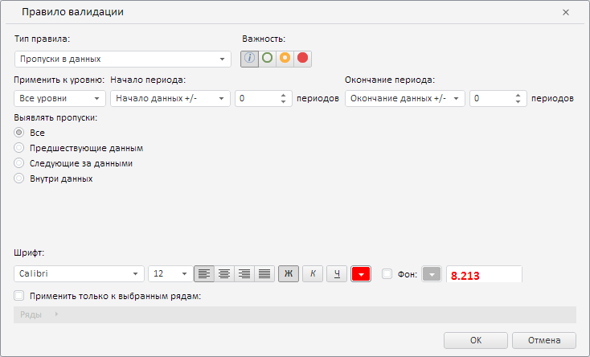

# WbkCategoryView.getValidationSettingsDialog

WbkCategoryView.getValidationSettingsDialog
-

**

# WbkCategoryView.getValidationSettingsDialog

## Синтаксис

getValidationSettingsDialog();

## Описание

Метод getValidationSettingsDialog** возвращает диалог настроек правил валидации.

## Комментарии

Метод возвращает значение типа PP.TS.Ui.ValidationSettingsDialog.

## Пример

Для выполнения примера необходимо наличие на html-странице компонента [WorkbookBox](../../../Components/TimeSeries/WorkbookBox/WorkbookBox.htm) с наименованием «workbookBox» (см. «[Пример создания компонента WorkbookBox](../../../Components/TimeSeries/WorkbookBox/Component_WorkbookBox.htm)»). Отобразим диалог настроек правил валидации:

// Получим ленту инструментов
var ribbon = workbookBox.getRibbonView();
// Получим категорию «Главная» ленты инструментов
var mainCategory = ribbon.getMainCategory();
// Получим диалог настроек правила валидации
var validationSettingsDialog = mainCategory.getValidationSettingsDialog();
// Отобразим диалог
validationSettingsDialog.show();

В результате выполнения примера был отображен диалог настроек правил валидации:

См. также:

[WbkCategoryView](WbkCategoryView.htm)

		Справочная
		 система на версию 10.9
		 от 18/08/2025,
		 © ООО «ФОРСАЙТ»,
