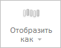

# WbkCategoryView.getViewAsButton

WbkCategoryView.getViewAsButton
-

# WbkCategoryView.getViewAsButton

## Синтаксис

getViewAsButton();

## Описание

Метод getViewAsButton возвращает кнопку «Отобразить как» на ленте инструментов рабочей книги.

## Комментарии

Метод возвращает значение типа [PP.Ui.RibbonButton](dhtmlRibbon.chm::/Classes/RibbonButton/RibbonButton.htm).

## Пример

Для выполнения примера необходимо наличие на html-странице компонента [WorkbookBox](../../../Components/TimeSeries/WorkbookBox/WorkbookBox.htm) с наименованием «workbookBox» (см. «[Пример создания компонента WorkbookBox](../../../Components/TimeSeries/WorkbookBox/Component_WorkbookBox.htm)»). Заблокируем и обновим кнопку «Отобразить как» на ленте инструментов рабочей книги:

// Получим ленту инструментов
var ribbon = workbookBox.getRibbonView();
// Получим категорию «Главная» ленты инструментов
var mainCategory = ribbon.getMainCategory();
// Получим кнопку «Отобразить как»
var viewAsButton = mainCategory.getViewAsButton();
// Заблокируем данную кнопку
viewAsButton.setEnabled(false);
// Обновим кнопку
mainCategory.updateViewAsMenu();

В результате выполнения примера была заблокирована и обновлена кнопка «Отобразить как» на ленте инструментов рабочей книги:

См. также:

[WbkCategoryView](WbkCategoryView.htm)

		Справочная
		 система на версию 10.9
		 от 18/08/2025,
		 © ООО «ФОРСАЙТ»,
