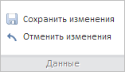

# WbkCategoryView.setEnabledEditingButtons

WbkCategoryView.setEnabledEditingButtons
-

# WbkCategoryView.setEnabledEditingButtons

## Синтаксис

setEnabledEditingButtons(value: Boolean);

## Параметры

value. Признак доступности кнопок сохранения и отмены изменений в рабочей книге. Если параметр равен значению true, то кнопки «Сохранить изменения» и «Откатить изменения» на ленте инструментов будут доступными, если значению false, то недоступными.

## Описание

Метод setEnabledEditingButtons управляет доступностью кнопок сохранения и отмены изменений на ленте инструментов рабочей книги.

## Пример

Для выполнения примера необходимо наличие на html-странице компонента [WorkbookBox](../../../Components/TimeSeries/WorkbookBox/WorkbookBox.htm) с наименованием «workbookBox» (см. «[Пример создания компонента WorkbookBox](../../../Components/TimeSeries/WorkbookBox/Component_WorkbookBox.htm)»). Сделаем доступными кнопки «Сохранить изменения» и «Откатить изменения» на вкладке «Данные» ленты инструментов:

// Получим ленту инструментов
var ribbon = workbookBox.getRibbonView();
// Получим категорию «Данные» ленты инструментов
var dataCategory = ribbon.getDataCategory();
// Сделаем кнопки «Сохранить изменения» и «Отменить изменения» доступными
dataCategory.setEnabledEditingButtons(true);

В результате выполнения примера кнопки «Сохранить изменения» и «Откатить изменения» на ленте инструментов рабочей книги стали доступными:

См. также:

[WbkCategoryView](WbkCategoryView.htm)

		Справочная
		 система на версию 10.9
		 от 18/08/2025,
		 © ООО «ФОРСАЙТ»,
