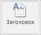

# WbkCategoryView.setPropertyValue

WbkCategoryView.setPropertyValue
-

# WbkCategoryView.setPropertyValue

## Синтаксис

setPropertyValue(propertyName: PP.TS.Ui.[WbkPropertyViews](../../../Enums/WbkPropertyViews.htm), value);

## Параметры

propertyName. Наименование настройки;

value. Устанавливаемое значение.

## Описание

Метод setPropertyValue определяет настройки ленты инструментов рабочей книги.

## Пример

Для выполнения примера необходимо наличие на html-странице компонента [WorkbookBox](../../../Components/TimeSeries/WorkbookBox/WorkbookBox.htm) с наименованием «workbookBox» (см. «[Пример создания компонента WorkbookBox](../../../Components/TimeSeries/WorkbookBox/Component_WorkbookBox.htm)»). Отобразим кнопку «Заголовок» на ленте инструментов в нажатом состоянии:

// Получим ленту инструментов
var ribbon = workbookBox.getRibbonView();
// Получим категорию «Главная» ленты инструментов
var mainCategory = ribbon.getMainCategory();
// Отобразим кнопку «Заголовок» в нажатом состоянии
mainCategory.setPropertyValue(PP.TS.Ui.WbkPropertyViews.VisibleTitle, true);

В результате выполнения примера кнопка «Заголовок» на ленте инструментов рабочей книги отобразилась в нажатом состоянии:

См. также:

[WbkCategoryView](WbkCategoryView.htm)

		Справочная
		 система на версию 10.9
		 от 18/08/2025,
		 © ООО «ФОРСАЙТ»,
