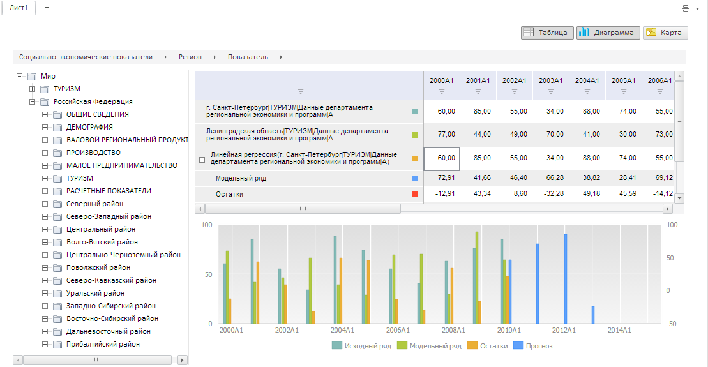

# Конструктор WbkDataBox

Конструктор WbkDataBox
-

# Конструктор WbkDataBox

## Синтаксис

PP.TS.Ui.WbkDataBox (settings);

## Параметры

settings.
 JSON-объект со значениями свойств компонента.

## Описание

Конструктор WbkDataBox
 создает экземпляр класса [WbkDataBox](WbkDataBox.htm).

## Пример

Для выполнения примера в теге HEAD html-страницы укажите ссылки на следующие
 js-файлы и css-файлы:

-
jquery.js;

-
Silverlight.js;

-
PP.ChartMaster.js;

-
PP.MapMaster.js;

-
PP.MapChart.js;

-
PP.Metabase.js;

-
PP.Express.js;

-
PP.TabSheet.js;

-
PP.TS.js.

В разных версиях браузера поместите в тег script и добавьте в тег HEAD
 html-страницы соответствующие css-файлы:

1. else if (PP.IsIE && PP.IEVer < 8) // Old IE

-
PP.App.css;

-
PP.Express.css;

-
PP.TS.css;

-
PP.Metabase.css;

-
PP_IE7.css;

-
PP.css.

2. else // All other

-
PP.css;

-
PP.App.css;

-
PP.Express.css;

-
PP.TS.css;

-
PP.Metabase.css.

Для отображения на экране Retina поместите в тег script и добавьте в
 тег HEAD html-страницы следующие css-файлы:

3. if (window.devicePixelRatio == 2) // Retina

-
PP.retina.css;

-
PP.App.retina.css;

-
PP.Express.retina.css;

-
PP.TS.retina.css;

- PP.Metabase.retina.css.

Также необходимо наличие рабочей книги с ключом 5183.

В теге <body> в качестве значения атрибута «onLoad» укажите имя
 функции, которая выполняется после окончания загрузки тела страницы:

<body onselectstart="return false" class="PPNoSelect" onload="Ready()">
	

	

</body>

В конце документа вставьте код для установки стилей к вершине «document.body»,
 которые соответствуют операционной системе клиента:

В теге SCRIPT добавьте следующий скрипт:

После выполнения примера на html-странице будет размещен компонент [WbkDataBox](../../../Components/TimeSeries/WbkDataBox/WbkDataBox.htm), имеющий следующий вид:

См. также:

[WbkDataBox](WbkDataBox.htm)

		Справочная
		 система на версию 10.9
		 от 18/08/2025,
		 © ООО «ФОРСАЙТ»,
