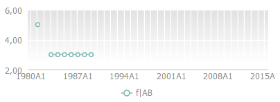

# WbkDataView.getChartView

WbkDataView.getChartView
-

# WbkDataView.getChartView

## Синтаксис

getChartView ();

## Описание

Метод getChartView возвращает
 компонент для отображения диаграммы.

## Комментарии

Возвращает экземпляр класса [EaxChartView](dhtmlExpress.chm::/Classes/Express/EaxChartView/EaxChartView.htm).

## Пример

Для выполнения примера предполагается наличие на странице компонента
 [WbkDataBox](../../../Components/TimeSeries/WbkDataBox/WbkDataBox.htm)
 c наименованием «wbkDataBox» (см. «[Конструктор
 WbkDataBox](../WbkDataBox/Constructor_WbkDataBox.htm)»), в рабочей области должна быть открыта диаграмма, а в
 обработчике события открытия документа необходимо добавить следующий код:

//получаем объект - компонент для отображения диаграммы (экземпляр класса PP.Exp.Ui.EaxChartView)
var chartView = wbkDataBox.getChartView();
//Устанавливаем длину компонента равную 400 пикселам
chartView.setWidth(400);

 После выполнения примера будет уменьшена ширина диаграммы рабочей
 книги до 400 пикселей:

См. также:

[WbkDataView](WbkDataView.htm)

		Справочная
		 система на версию 10.9
		 от 18/08/2025,
		 © ООО «ФОРСАЙТ»,
