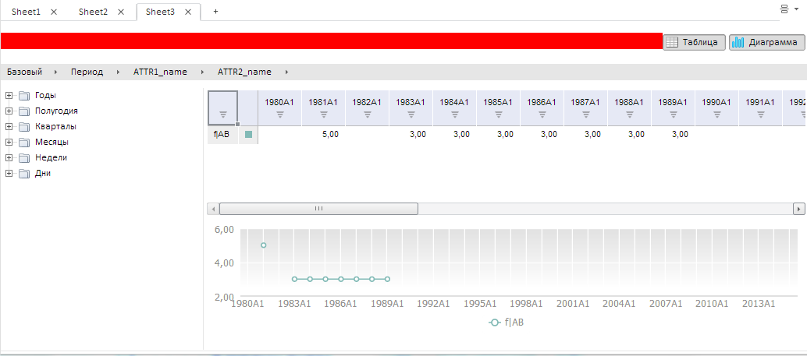

# WbkDataView.getTitleView

WbkDataView.getTitleView
-

# WbkDataView.getTitleView

## Синтаксис

getTitleView ();

## Описание

Метод getTitleView возвращает
 компонент для отображения заголовка рабочей книги.

## Комментарии

Возвращает экземпляр класса [EaxTitleView](dhtmlExpress.chm::/Classes/Express/TitleBox/TitleBox.htm).

## Пример

Для выполнения примера предполагается наличие на странице компонента
 [WbkDataBox](../../../Components/TimeSeries/WbkDataBox/WbkDataBox.htm)
 c наименованием «wbkDataBox» (см. «[Конструктор
 WbkDataBox](../WbkDataBox/Constructor_WbkDataBox.htm)»), также необходимо в обработчике события открытия документа
 добавить следующий код:

//Получаем объект для отображения заголовка рабочей книги (экземпляр класса PP.Exp.Ui.EaxTitleView)
var title = wbkDataBox.getTitleView();
//Отображаем заголовок
title.show();
//Получаем DOM-вершину, в которой расположен элемент
var node = title.getDomNode();
//Устанавливаем цвет фона элемента в красный
node.style.backgroundColor = "red";

После выполнения примера будет отображен заголовок рабочей книги и для
 него будет установлен красный цвет фона.

См. также:

[WbkDataView](WbkDataView.htm)

		Справочная
		 система на версию 10.9
		 от 18/08/2025,
		 © ООО «ФОРСАЙТ»,
