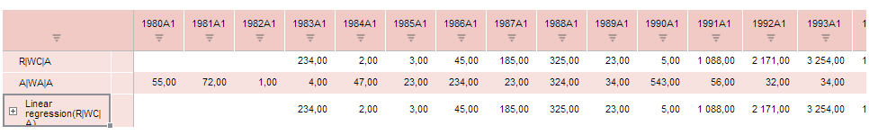

# WbkDataView.refresh

WbkDataView.refresh
-

# WbkDataView.refresh

## Синтаксис

refresh (args);

## Параметры

args. Параметр, определяющий, что нужно обновить.

## Описание

Метод refresh обновляет указанные элементы рабочей книги.

## Пример

Для выполнения примера предполагается наличие на странице компонента [WorkbookBox](../../../Components/TimeSeries/WorkbookBox/WorkbookBox.htm) с наименованием «workbookBox» (см. «[Пример создания компонента WorkbookBox](../../../Components/TimeSeries/WorkbookBox/Component_WorkbookBox.htm)»), также необходимо в обработчике события открытия документа заменить код открытия документа на следующий:

var setTableStyleButt = new PP.Ui.Button({
	ParentNode: document.body, //родительский узел DOM
	Content: "Установить стиль таблицы", //подпись
	Click: PP.Delegate(onClickSetTableStyle)
});
function onClickSetTableStyle()
	{
		var report = args.Workbook;
		var metadata = {
			Name: "EAX table style",
			PredefinedStyle: "ExtRedStriped"
		};
		//Устанавливаем стиль
		var pattern = {};
		pattern.gridStyle =
		{
			parts:
				{
					it: ["Table"]
				}
		};
		pattern.filter = true;
		pattern.grid = true;
		pattern.pivot = true;
		//Формируем тело запроса к серверу
		var body = {
			SetEaxMd:
				{
					tEax: report.getOdId(),
					tArg:
						{
							pattern: pattern,
							meta:
								{
									grid:
									{
										style: {
											table: metadata
										}
									}
								},
								refresh:
								{
									fetchData: false,
									grid: true
								},
								metaGet: tsService._getDefaultMetaGet()
							}
						}
					};
					callback = tsService._visitCallback(PP.Delegate(onTableStyle));
					tsService._send(body, callback);
				}
				//Обработчик завершения метода setTableStyle
				function onTableStyle(sender, args){

					var res = JSON.parse(args.ResponseText);
					var metadata = {
					Name: "Eax table style",
					PredefinedStyle: "ExtRedStriped",
					Response: res
					}
					//Создаем объект класса PP.Mb.Ui.PropertyChangedEventArgs, который будет использоваться
					//в качестве параметра к методу refresh
					var arguments = new PP.Mb.Ui.PropertyChangedEventArgs({
						PropertyName: "RibbonTableStyle",
						Metadata: metadata,
						TypeUpdateData: [PP.Exp.Ui.ViewTypeUpdate.Table, PP.Exp.Ui.ViewTypeUpdate.Ribbon]
					});
					//Обновляем указанные элементы рабочей книги
					workbookBox.getDataView().refresh(arguments);
				}

После выполнения примера на html-странице будет размещен компонент [WorkbookBox](../../../Components/TimeSeries/WorkbookBox/WorkbookBox.htm) и кнопка с наименованием «Установить стиль таблицы». По нажатию на кнопку обновится и выделится в красный цвет рабочая книга.

См. также:

[WbkDataView](WbkDataView.htm)

		Справочная
		 система на версию 10.9
		 от 18/08/2025,
		 © ООО «ФОРСАЙТ»,
