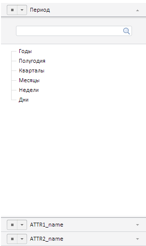

# Конструктор WbkPropertyBar

Конструктор WbkPropertyBar
-

# Конструктор WbkPropertyBar

## Синтаксис

PP.TS.Ui.WbkPropertyBar(settings);

## Параметры

settings. JSON-объект со значениями
 свойств компонента.

## Описание

Конструктор WbkPropertyBar экземпляр
 класса [WbkPropertyBar](WbkPropertyBar.htm).

## Пример

Для выполнения примера в теге HEAD html-страницы укажите ссылки на следующие
 js-файлы и css-файлы:

	- PP.css;

	- PP.Express.css;

	- PP.TS.css;

	- PP.Metabase.css;

	- PP.js;

	- PP.Metabase.js;

	- PP.Express.js;

	- PP.TS.js.

А также наличие рабочей книги с ключом 5183.

В теге <body> в качестве значения атрибута «onLoad» указываем
 имя функции, которая выполняется после окончания загрузки тела страницы:

<body  onselectstart="return false" class="PPNoSelect" onload="Ready()">
	

</body>

В конце документа вставляем код для установки стилей к вершине «document.body»,
 которые соответствуют операционной системе клиента:

В теге SCRIPT добавьте следующий скрипт:

После выполнения примера на html-странице будет размещен компонент [WbkPropertyBar](WbkPropertyBar.htm), имеющий следующий вид:

См. также:

[WbkPropertyBar](WbkPropertyBar.htm)

		Справочная
		 система на версию 10.9
		 от 18/08/2025,
		 © ООО «ФОРСАЙТ»,
