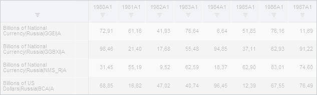

# WbkPropertyBarView.GridView

WbkPropertyBarView.GridView
-

# WbkPropertyBarView.GridView

## Синтаксис

GridView: PP.TS.Ui.[LanerBoxView](../LanerBoxView/LanerBoxView.htm);

## Описание

Свойство GridView определяет
 компонент для отображения таблицы.

## Комментарии

Значение свойства устанавливается из JSON и с помощью метода setGridView,
 а возвращается с помощью метода getGridView.

## Пример

Для выполнения примера необходимо наличие на html-странице компонента
 [WorkbookBox](../../../Components/TimeSeries/WorkbookBox/WorkbookBox.htm)
 с наименованием «workbookBox» (см. «[Пример
 создания компонента WorkbookBox](../../../Components/TimeSeries/WorkbookBox/Component_WorkbookBox.htm)»), также необходимо, чтобы было отображено
 представление «Таблица». Сделаем таблицу неактивной:

// Получим панель свойств рабочей книги
var propertyBarView = workbookBox.getPropertyBarView();
// Установим вид отображения панели свойств
propertyBarView.setType(PP.TS.Ui.PropertyPanelTypeEnum.Series);
// Получим объект таблицы
var gridView = propertyBarView.getGridView();
// Сделаем таблицу неактивной
if (propertyBarView.getType() == PP.TS.Ui.PropertyPanelTypeEnum.Series) {
    gridView.setEnabled(false);
}
// Зададим новый объект таблицы
propertyBarView.setGridView(gridView);

В результате выполнения примера таблица стала неактивной:

См. также:

[WbkPropertyBarView](WbkPropertyBarView.htm)

		Справочная
		 система на версию 10.9
		 от 18/08/2025,
		 © ООО «ФОРСАЙТ»,
