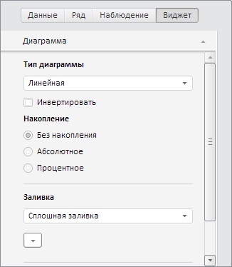

# WbkPropertyBarView.getChartMaster

WbkPropertyBarView.getChartMaster
-

# WbkPropertyBarView.getChartMaster

## Синтаксис

getChartMaster(chartView: [PP.Exp.Ui.EaxChartView](dhtmlExpress.chm::/Classes/Express/EaxChartView/EaxChartView.htm));

## Параметры

chartView. Компонент
 для отображения диаграммы.

## Описание

Метод getChartMaster возвращает
 мастер диаграмм.

## Комментарии

Метод возвращает объект типа [PP.Ui.ChartMaster](dhtmlChart.chm::/Classes/ChartMaster/ChartMaster.htm).

## Пример

Для выполнения примера необходимо наличие на html-странице компонента
 [WorkbookBox](../../../Components/TimeSeries/WorkbookBox/WorkbookBox.htm)
 с наименованием «workbookBox» (см. «[Пример
 создания компонента WorkbookBox](../../../Components/TimeSeries/WorkbookBox/Component_WorkbookBox.htm)»), так же необходимо отображение всех
 представлений рабочей книги. Скроем все мастера, отобразим мастер диаграмм
 и обновим панель свойств рабочей книги:

// Получим панель свойств рабочей книги
var propertyBarView = workbookBox.getPropertyBarView();
// Скроем все мастера
propertyBarView.hideAllMasters();
// Определим переменную мастера диаграмм
var chartMaster = propertyBarView.getChartMaster(workbookBox.getDataView().getChartView());
// Отобразим мастер диаграмм
chartMaster.show();
// Обновим компонент
propertyBarView.refreshAll();

В результате выполнения примера были скрыты все мастера, был отображен
 мастер диаграмм и обновлена панель свойств рабочей книги:

См. также:

[WbkPropertyBarView](WbkPropertyBarView.htm)

		Справочная
		 система на версию 10.9
		 от 18/08/2025,
		 © ООО «ФОРСАЙТ»,
