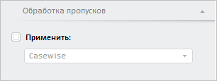

# WbkPropertyBarView.getEquationProcessPanel

WbkPropertyBarView.getEquationProcessPanel
-

# WbkPropertyBarView.getEquationProcessPanel

## Синтаксис

getEquationProcessPanel();

## Описание

Метод getEquationProcessPanel возвращает панель «Обработка пропусков».

## Комментарии

Метод возвращает объект типа PP.TS.Ui.[EquationProcessPanel](../EquationProcessPanel/EquationProcessPanel.htm).

## Пример

Для выполнения примера необходимо наличие на html-странице компонента [WorkbookBox](../../../Components/TimeSeries/WorkbookBox/WorkbookBox.htm) с наименованием «workbookBox» (см. «[Пример создания компонента WorkbookBox](../../../Components/TimeSeries/WorkbookBox/Component_WorkbookBox.htm)». Отобразим панель «Обработка пропусков»:

// Получим панель свойств рабочей книги
var propertyBar = workbookBox.getPropertyBarView();
// Получим панель «Обработка пропусков»
var equationProcessPanel = propertyBar.getEquationProcessPanel();
// Отобразим данную панель
equationProcessPanel.show();
// Развернём панель
equationProcessPanel.expand();

В результате выполнения примера была отображена панель «Обработка пропусков»:

См. также:

[WbkPropertyBarView](WbkPropertyBarView.htm)

		Справочная
		 система на версию 10.9
		 от 18/08/2025,
		 © ООО «ФОРСАЙТ»,
