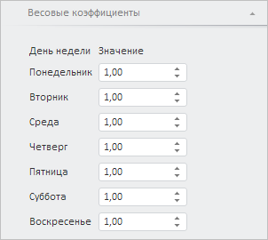

# WbkPropertyBarView.getEquationWeightCoefficientsPanel

WbkPropertyBarView.getEquationWeightCoefficientsPanel
-

# WbkPropertyBarView.getEquationWeightCoefficientsPanel

## Синтаксис

getEquationWeightCoefficientsPanel();

## Описание

Метод getEquationWeightCoefficientsPanel возвращает панель «Весовые коэффициенты».

## Комментарии

Метод возвращает объект типа PP.TS.Ui.[EquationWeightCoefficientsPanel](../EquationWeightCoefficientsPanel/EquationWeightCoefficientsPanel.htm).

## Пример

Для выполнения примера необходимо наличие на html-странице компонента [WorkbookBox](../../../Components/TimeSeries/WorkbookBox/WorkbookBox.htm) с наименованием «workbookBox» (см. «[Пример создания компонента WorkbookBox](../../../Components/TimeSeries/WorkbookBox/Component_WorkbookBox.htm)». Отобразим панель «Весовые коэффициенты»:

// Получим панель свойств рабочей книги
var propertyBar = workbookBox.getPropertyBarView();
// Получим панель «Весовые коэффициенты»
var equationWeightCoefficientsPanel = propertyBar.getEquationWeightCoefficientsPanel();
// Отобразим панель
equationWeightCoefficientsPanel.show();
// Развернём панель
equationWeightCoefficientsPanel.expand();

В результате выполнения примера была отображена панель «Весовые коэффициенты»:

См. также:

[WbkPropertyBarView](WbkPropertyBarView.htm)

		Справочная
		 система на версию 10.9
		 от 18/08/2025,
		 © ООО «ФОРСАЙТ»,
