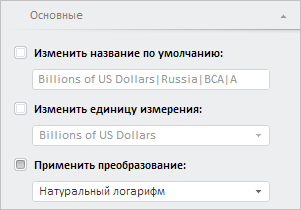

# WbkPropertyBarView.getMainSeriesPanel

WbkPropertyBarView.getMainSeriesPanel
-

# WbkPropertyBarView.getMainSeriesPanel

## Синтаксис

getMainSeriesPanel();

## Описание

Метод getMainSeriesPanel возвращает панель «Основные».

## Комментарии

Метод возвращает объект типа PP.TS.Ui.[MainSeriesPanel](../MainSeriesPanel/MainSeriesPanel.htm).

## Пример

Для выполнения примера необходимо наличие на html-странице компонента [WorkbookBox](../../../Components/TimeSeries/WorkbookBox/WorkbookBox.htm) с наименованием «workbookBox» (см. «[Пример создания компонента WorkbookBox](../../../Components/TimeSeries/WorkbookBox/Component_WorkbookBox.htm)». Отобразим панель «Основные»:

// Получим панель свойств рабочей книги
var propertyBar = workbookBox.getPropertyBarView();
// Получим панель «Основные»
var mainSeriesPanel = propertyBar.getMainSeriesPanel();
// Отобразим панель
mainSeriesPanel.show();
// Развернём панель
mainSeriesPanel.expand();
// Обновим раскрывающийся список «Применить преобразование»
propertyBar.updateViewAsMenu();

В результате выполнения примера была отображена панель «Основные»:

См. также:

[WbkPropertyBarView](WbkPropertyBarView.htm)

		Справочная
		 система на версию 10.9
		 от 18/08/2025,
		 © ООО «ФОРСАЙТ»,
