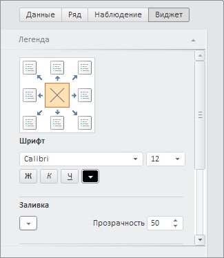

# WbkPropertyBarView.getMapMaster

WbkPropertyBarView.getMapMaster
-

# WbkPropertyBarView.getMapMaster

## Синтаксис

getMapMaster(mapView: PP.Exp.Ui.[EaxMapView](dhtmlExpress.chm::/Classes/Express/EaxMapView/EaxMapView.htm));

## Параметры

mapView. Компонент для отображения
 карты.

## Описание

Метод getMapMaster возвращает
 мастер карты.

## Комментарии

Метод возвращает объект типа [PP.Ui.MapMaster](dhtmlMapChart.chm::/Classes/MapMaster/MapMaster.htm).

## Пример

Для выполнения примера необходимо наличие на html-странице компонента
 [WorkbookBox](../../../Components/TimeSeries/WorkbookBox/WorkbookBox.htm)
 с наименованием «workbookBox» (см. «[Пример
 создания компонента WorkbookBox](../../../Components/TimeSeries/WorkbookBox/Component_WorkbookBox.htm)»), а так же необходимо отображение
 всех представлений рабочей книги. Отобразим мастер карты:

// Получим панель свойств рабочей книги
var propertyBarView = workbookBox.getPropertyBarView();
// Скроем все мастера
propertyBarView.hideAllMasters();
// Определим переменную мастера карты
var mapMaster = propertyBarView.getMapMaster(workbookBox.getDataView().getMapView());
// Отобразим мастер карты
mapMaster.show();

В результате выполнения примера был отображен мастер карты:

См. также:

[WbkPropertyBarView](WbkPropertyBarView.htm)

		Справочная
		 система на версию 10.9
		 от 18/08/2025,
		 © ООО «ФОРСАЙТ»,
