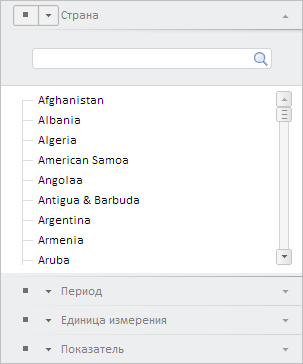

# WbkPropertyBarView.getNavBreadcrumb

WbkPropertyBarView.getNavBreadcrumb
-

# WbkPropertyBarView.getNavBreadcrumb

## Синтаксис

getNavBreadcrumb();

## Описание

Метод getNavBreadcrumb возвращает компонент для управления атрибутами рабочей книги.

## Комментарии

Метод возвращает объект типа PP.TS.Ui.[NavBreadcrumbView](../NavBreadcrumbView/NavBreadcrumbView.htm).

## Пример

Для выполнения примера необходимо наличие на html-странице компонента [WorkbookBox](../../../Components/TimeSeries/WorkbookBox/WorkbookBox.htm) с наименованием «workbookBox» (см. «[Пример создания компонента WorkbookBox](../../../Components/TimeSeries/WorkbookBox/Component_WorkbookBox.htm)». Отобразим компонент для управления атрибутами рабочей книги, пересоздадим панель ревизий, удалим лишние вкладки с ревизиями:

// Получим панель свойств рабочей книги
var propertyBar = workbookBox.getPropertyBarView();
// Спрячем все мастеры
propertyBar.hideAllMasters();
// Получим компонент для управления атрибутами рабочей книги
var navBreadcrumb = propertyBar.getNavBreadcrumb();
// Отобразим компонент
navBreadcrumb.show();
// Получим ключ каталога показателей ревизий
var rubKey = propertyBarView.getSource().getWbkMetadata().rubrs.its.it[0].k;
// Пересоздадим панель ревизий
propertyBarView.updateRevisionPanel(rubKey);
// Удалим лишние вкладки с ревизиями
propertyBarView.deleteExtraRevisionPanels();

В результате выполнения примера был отображен компонент для управления атрибутами рабочей книги:

См. также:

[WbkPropertyBarView](WbkPropertyBarView.htm)

		Справочная
		 система на версию 10.9
		 от 18/08/2025,
		 © ООО «ФОРСАЙТ»,
