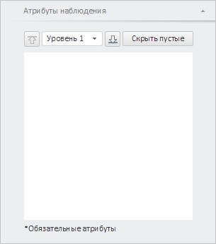

# WbkPropertyBarView.getObserveAttributesPanel

WbkPropertyBarView.getObserveAttributesPanel
-

# WbkPropertyBarView.getObserveAttributesPanel

## Синтаксис

getObserveAttributesPanel();

## Описание

Метод getObserveAttributesPanel
 возвращает панель «Атрибуты наблюдения».

## Комментарии

Метод возвращает объект типа PP.TS.Ui.[MetaDataViewerPanel](../MetaDataViewerPanel/MetaDataViewerPanel.htm).

## Пример

Для выполнения примера необходимо наличие на html-странице компонента
 [WorkbookBox](../../../Components/TimeSeries/WorkbookBox/WorkbookBox.htm)
 с наименованием «workbookBox» (см. «[Пример
 создания компонента WorkbookBox](../../../Components/TimeSeries/WorkbookBox/Component_WorkbookBox.htm)». Отобразим панель «Атрибуты наблюдения»:

// Получим панель свойств рабочей книги
var propertyBar = workbookBox.getPropertyBarView();
// Спрячем все мастера
propertyBar.hideAllMasters();
// Получим панель «Атрибуты наблюдения».
var observeAttributesPanel = propertyBar.getObserveAttributesPanel();
// Отобразим панель
observeAttributesPanel.show();
// Развернём панель
observeAttributesPanel.expand();

В результате выполнения примера была отображена панель «Атрибуты наблюдения»:

См. также:

[WbkPropertyBarView](WbkPropertyBarView.htm)

		Справочная
		 система на версию 10.9
		 от 18/08/2025,
		 © ООО «ФОРСАЙТ»,
