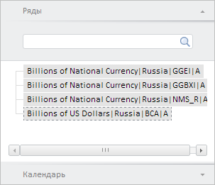

# WbkPropertyBarView.getPeriodSeriesViewPanel

WbkPropertyBarView.getPeriodSeriesViewPanel
-

**

# WbkPropertyBarView.getPeriodSeriesViewPanel

## Синтаксис

getPeriodSeriesViewPanel();

## Описание

Метод getPeriodSeriesViewPanel** возвращает панель управления атрибутами рабочей книги.

## Комментарии

Метод возвращает объект типа PP.TS.Ui.PeriodSeriesViewMaster.

## Пример

Для выполнения примера необходимо наличие на html-странице компонента [WorkbookBox](../../../Components/TimeSeries/WorkbookBox/WorkbookBox.htm) с наименованием «workbookBox» (см. «[Пример создания компонента WorkbookBox](../../../Components/TimeSeries/WorkbookBox/Component_WorkbookBox.htm)». Отобразим панель управления атрибутами рабочей книги:

// Получим панель свойств рабочей книги
var propertyBar = workbookBox.getPropertyBarView();
// Получим панель управления атрибутами рабочей книги
var periodSeriesViewPanel = propertyBar.getPeriodSeriesViewPanel();
// Отобразим данную панель
periodSeriesViewPanel.show();

В результате выполнения примера была отображена панель управления атрибутами рабочей книги:

См. также:

[WbkPropertyBarView](WbkPropertyBarView.htm)

		Справочная
		 система на версию 10.9
		 от 18/08/2025,
		 © ООО «ФОРСАЙТ»,
