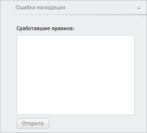

# WbkPropertyBarView.getSerieValidationErrorsPanel

WbkPropertyBarView.getSerieValidationErrorsPanel
-

**

# WbkPropertyBarView.getSerieValidationErrorsPanel

## Синтаксис

getSerieValidationErrorsPanel();

## Описание

Метод getSerieValidationErrorsPanel** возвращает панель «Ошибки валидации» вкладки «Ряд».

## Комментарии

Метод возвращает объект типа PP.TS.Ui.ValidationErrorsPanel.

## Пример

Для выполнения примера необходимо наличие на html-странице компонента [WorkbookBox](../../../Components/TimeSeries/WorkbookBox/WorkbookBox.htm) с наименованием «workbookBox» (см. «[Пример создания компонента WorkbookBox](../../../Components/TimeSeries/WorkbookBox/Component_WorkbookBox.htm)». Отобразим панель «Ошибки валидации»:

// Получим панель свойств рабочей книги
var propertyBar = workbookBox.getPropertyBarView();
// Получим панель «Ошибки валидации»
var serieValidationErrorsPanel = propertyBar.getSerieValidationErrorsPanel();
// Отобразим данную панель
serieValidationErrorsPanel.show();
// Развернём панель
serieValidationErrorsPanel.expand();

В результате выполнения примера была отображена панель «Ошибки валидации»:

См. также:

[WbkPropertyBarView](WbkPropertyBarView.htm)

		Справочная
		 система на версию 10.9
		 от 18/08/2025,
		 © ООО «ФОРСАЙТ»,
