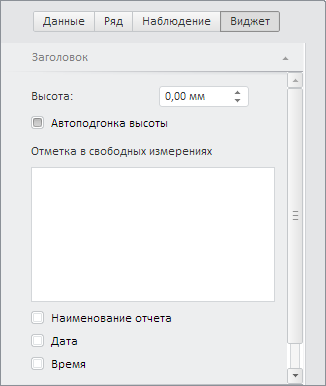

# WbkPropertyBarView.getTitlePanel

WbkPropertyBarView.getTitlePanel
-

# WbkPropertyBarView.getTitlePanel

## Синтаксис

getTitlePanel(titleView: PP.Exp.Ui.[EaxTitleView](dhtmlExpress.chm::/Classes/Express/TitleBox/TitleBox.htm));

## Параметры

titleView. Компонент
 для отображения заголовка.

## Описание

Метод getTitlePanel возвращает
 панель «Заголовок» вкладки «Формат».

## Пример

Для выполнения примера необходимо наличие на html-странице компонента
 [WorkbookBox](../../../Components/TimeSeries/WorkbookBox/WorkbookBox.htm)
 с наименованием «workbookBox» (см. «[Пример
 создания компонента WorkbookBox](../../../Components/TimeSeries/WorkbookBox/Component_WorkbookBox.htm)»), а так же необходимо отображение
 всех представлений рабочей книги. Отобразим мастер заголовка:

// Получим панель свойств рабочей книги
var propertyBarView = workbookBox.getPropertyBarView();
// Скроем все мастера
propertyBarView.hideAllMasters();
// Панель для настройки заголовка
var titleMaster = propertyBarView.getTitlePanel(workbookBox.getDataView().getTitleView());
// Отобразим мастер заголовка
titleMaster.show();

В результате выполнения примера была отображена панель «Заголовок»:

[WbkPropertyBarView](WbkPropertyBarView.htm)

		Справочная
		 система на версию 10.9
		 от 18/08/2025,
		 © ООО «ФОРСАЙТ»,
