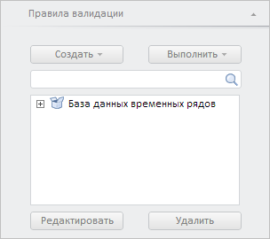

# WbkPropertyBarView.getValidationPanel

WbkPropertyBarView.getValidationPanel
-

**

# WbkPropertyBarView.getValidationPanel

## Синтаксис

getValidationPanel();

## Описание

Метод getValidationPanel**
 возвращает панель «Правила валидации».

## Комментарии

Метод возвращает объект типа PP.TS.Ui.ValidationRulesPanel.

## Пример

Для выполнения примера необходимо наличие на html-странице компонента
 [WorkbookBox](../../../Components/TimeSeries/WorkbookBox/WorkbookBox.htm)
 с наименованием «workbookBox» (см. «[Пример
 создания компонента WorkbookBox](../../../Components/TimeSeries/WorkbookBox/Component_WorkbookBox.htm)». Отобразим панель «Правила валидации»:

// Получим панель свойств рабочей книги
var propertyBar = workbookBox.getPropertyBarView();
// Получим панель «Правила валидации»
var validationPanel = propertyBar.getValidationPanel();
// Отобразим данную панель
validationPanel.show();
// Развернём панель
validationPanel.expand();

В результате выполнения примера была отображена панель «Правила валидации»:

См. также:

[WbkPropertyBarView](WbkPropertyBarView.htm)

		Справочная
		 система на версию 10.9
		 от 18/08/2025,
		 © ООО «ФОРСАЙТ»,
