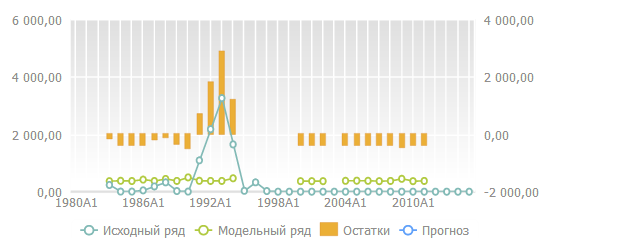

# WbkRibbonView.ChartDataView

WbkRibbonView.ChartDataView
-

# WbkRibbonView.ChartDataView

## Синтаксис

ChartDataView: PP.Exp.Ui.[EaxChartView](dhtmlExpress.chm::/Classes/Express/EaxChartView/EaxChartView.htm);

## Описание

Свойство ChartDataView определяет
 диаграмму, настройки которой будут изменяться из ленты.

## Пример

Для выполнения примера предполагается наличие на странице компонента
 [WorkbookBox](../../../Components/TimeSeries/WorkbookBox/WorkbookBox.htm)
 с наименованием «workbookBox» (см. «[Пример
 создания компонента WorkbookBox](../../../Components/TimeSeries/WorkbookBox/Component_WorkbookBox.htm)»), также необходимо в обработчике
 события открытия документа добавить следующий код:

//Получаем компонент Ribbon
var ribbonView = workbookBox.getRibbonView();
var chartDataViewButt = new PP.Ui.Button({
ParentNode: document.body, //Родительский узел DOM
Content: "Изменить диаграмму", //Подпись
Click: PP.Delegate(onClickChartDataView)
});
	function onClickChartDataView()
{
//Получаем объект построения временных рядов
var chartDataView = ribbonView.getChartDataView();
//Устанавливаем ширину временных рядов
chartDataView.setWidth(500);
}

После выполнения примера при нажатии на кнопку «Изменить диаграмму»
 будет построена следующая диаграмма по полученному объекту временных рядов:

См. также:

[WbkRibbonView](WbkRibbonView.htm)

		Справочная
		 система на версию 10.9
		 от 18/08/2025,
		 © ООО «ФОРСАЙТ»,
