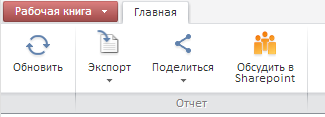

# WbkRibbonView.getReadonlyCategory

WbkRibbonView.getReadonlyCategory
-

# WbkRibbonView.getReadonlyCategory

## Синтаксис

getReadonlyCategory ();

## Описание

Метод getReadonlyCategory возвращает
 вкладку ленты «Главная» в режиме просмотра.

## Комментарии

Метод возвращает объект класса [WbkRibbon](../WbkRibbon/WbkRibbon.htm).

## Пример

Для выполнения примера предполагается наличие на странице компонента
 [WorkbookBox](../../../Components/TimeSeries/WorkbookBox/WorkbookBox.htm)
 с наименованием «workbookBox» (см. «[Пример
 создания компонента WorkbookBox](../../../Components/TimeSeries/WorkbookBox/Component_WorkbookBox.htm)»), открыть документ с помощью функции
 [openDocument](dhtmlExpress.chm::/Classes/Express/EaxMdService/EaxMdService.openDocument.htm),
 также необходимо в обработчике события открытия документа добавить следующий
 код:

//Возвращаем вкладку ленты «Главная» в режиме просмотра
var readonlyCat = workbookBox.getRibbonView().getReadonlyCategory();
//Возвращаем кнопку «Обсудить в SharePoint»
var sharePointButton = readonlyCat.getSharePointButton();
var state = true;
//Делаем видимой кнопку «Обсудить в SharePoint»
sharePointButton.show();
//Получаем компонент Ribbon
var ribbonView = workbookBox.getRibbonView();
//Подписываемся на событие нажатия кнопки «Обсудить в SharePoint» ленты инструментов
ribbonView.Discuss.add(function()
{
	alert('Нажата кнопка  «Обсудить в SharePoint»');
});

После выполнения примера на вкладку ленты «Главная» в режиме просмотра
 будет добавлена кнопка «Обсудить в SharePoint», при нажатии на которую
 на экран будет выводиться соответствующее сообщение:

См. также:

[WbkRibbonView](WbkRibbonView.htm)

		Справочная
		 система на версию 10.9
		 от 18/08/2025,
		 © ООО «ФОРСАЙТ»,
