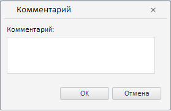

# Конструктор WbkSaveDataDialog

Конструктор WbkSaveDataDialog
-

# Конструктор WbkSaveDataDialog

## Синтаксис

PP.TS.Ui.WbkSaveDataDialog  (settings);

## Параметры

settings. JSON-объект со значениями свойств компонента.

## Описание

Конструктор WbkSaveDataDialog создает экземпляр класса [WbkSaveDataDialog](WbkSaveDataDialog.htm).

## Пример

Для выполнения примера в теге HEAD html-страницы укажите ссылки на следующие js и css-файлы:

-
PP.css;

-
PP.Express.css;

-
PP.TS.css;

-
PP.Metabase.css;

-
PP.js;

-
PP.Metabase.js;

-
PP.Express.js;

-
PP.TS.js.

В теге <body> в качестве значения атрибута «onLoad» указываем имя функции, которая выполняется после окончания загрузки тела страницы:

<body onselectstart="return false" class="PPNoSelect" style="margin: 0px">
	<input type="button" value="save data" onclick="openDialog();" />
</body>

В конце документа вставляем код для установки стилей к вершине «document.body», которые соответствуют операционной системе клиента:

В теге SCRIPT добавьте следующий скрипт:

После выполнения примера на html-странице будет размещена кнопка «save data», при нажатии на которую появится диалог для создания комментария:

См. также:

[WbkSaveDataDialog](WbkSaveDataDialog.htm)

		Справочная
		 система на версию 10.9
		 от 18/08/2025,
		 © ООО «ФОРСАЙТ»,
