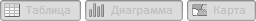

# WbkToolBarView.getChartButton

WbkToolBarView.getChartButton
-

# WbkToolBarView.getChartButton

## Синтаксис

getChartButton();

## Описание

Метод getChartButton возвращает
 кнопку «Диаграмма» компонента [WbkToolBar](../WbkToolBar/WbkToolBar.htm).

## Комментарии

Метод возвращает объект типа PP.Ui.[ToolBarButton](dhtmlUi.chm::/Classes/ToolBarButton/ToolBarButton.htm).

## Пример

Для выполнения примера необходимо наличие на html-странице компонента
 [WorkbookBox](../../../Components/TimeSeries/WorkbookBox/WorkbookBox.htm)
 с наименованием «workbookBox» (см. «[Пример
 создания компонента WorkbookBox](../../../Components/TimeSeries/WorkbookBox/Component_WorkbookBox.htm)»). Сделаем неактивными кнопки представлений
 «Диаграмма», «Карта», «Таблица», а так же обновим панель инструментов
 управления видимостью представлений:

// Получим панель инструментов управления видимостью представлений рабочей книги
var toolBarView = workbookBox.getDataView().getToolBarView();
// Получим кнопку «Диаграмма»
var chartButton = toolBarView.getChartButton();
// Сделаем кнопку неактивной
chartButton.setEnabled(false);
// Получим кнопку «Карта»
var mapButton = toolBarView.getMapButton();
// Сделаем кнопку неактивной
mapButton.setEnabled(false);
// Получим кнопку «Таблица»
var gridButton = toolBarView.getGridButton();
// Сделаем кнопку неактивной
gridButton.setEnabled(false);
// Обновим компонент
toolBarView.refreshAll();

В результате выполнения примера кнопки представлений «Диаграмма», «Карта»,
 «Таблица» стали неактивными и была обновлена панель инструментов управления
 видимостью представлений:

См. также:

[WbkToolBarView](WbkToolBarView.htm)

		Справочная
		 система на версию 10.9
		 от 18/08/2025,
		 © ООО «ФОРСАЙТ»,
