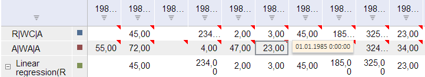

# Workbook.CommentAttribute

Workbook.CommentAttribute
-

# Workbook.CommentAttribute

## Синтаксис

CommentAttribute: Object;

## Описание

Свойство CommentAttribute определяет атрибут, используемый в качестве всплывающей подсказки для ячеек в таблице.

## Пример

Для выполнения примера предполагается наличие на странице компонента [WorkbookBox](../../../Components/TimeSeries/WorkbookBox/WorkbookBox.htm) с наименованием «workbookBox» (см. «[Пример создания компонента WorkbookBox](../../../Components/TimeSeries/WorkbookBox/Component_WorkbookBox.htm)»), также необходимо в обработчике события открытия документа добавить следующий код:

	var commentAttributeButton = new PP.Ui.Button({
		ParentNode: document.body, //Родительский узел DOM
		Content: "Установить всплывающую подсказку", //Подпись
		Click: PP.Delegate(onClick)
	});

	function onClick()
	{
		//Создаем объект, в котором содержится информация о типе всплывающей подсказки:
		//7 - Значение;
		//5 - Дата;
		//8 - Примечание.
		var commentAttribute = {k:5};
		wbk.setCommentAttribute(commentAttribute);
		tsService.editAllSeries(wbk, {its: { it: [] },commentAttribute : wbk.getCommentAttribute()}, onRowsEdited);
		function onRowsEdited(){
			//Обновляем компонент workbookBox
			workbookBox.refreshAll();
		}
	}

После выполнения примера на html-странице будет размещена кнопка с наименованием «Установить всплывающую подсказку». Необходимо нажать на нее и после этого, при наведении на ячейку в таблице, помеченную красной меткой, будет отображаться всплывающая подсказка, содержащая информацию о дате:

См. также:

[Workbook](Workbook.htm)

		Справочная
		 система на версию 10.9
		 от 18/08/2025,
		 © ООО «ФОРСАЙТ»,
