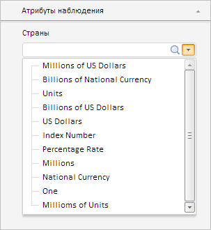
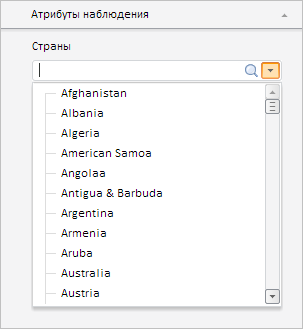

# Workbook.DimsObs

Workbook.DimsObs
-

# Workbook.DimsObs

## Синтаксис

DimsObs: Array;

## Описание

Свойство DimsObs устанавливает
 измерения для ссылающихся на справочники атрибутов наблюдения рабочей
 книги.

## Комментарии

Значение свойства устанавливается из JSON или с помощью метода setDimsObs, а возвращается - с помощью
 метода getDimsObs.

Свойство содержит массив объектов типа [PP.Mb.DimSource](dhtmlDim.chm::/Classes/Metabase/DimSource/DimSource.htm).

При вызове метода setDimsObs
 указываются следующие параметры: value - измерение, представленное объектом
 типа [PP.Mb.DimSource](dhtmlDim.chm::/Classes/Metabase/DimSource/DimSource.htm),
 key - ключ данного измерения.

При вызове метода getDimsObs
 указывается параметр key - ключ измерения.

## Пример

Для выполнения примера необходимо наличие на html-странице компонента
 [WorkbookBox](../../../Components/TimeSeries/WorkbookBox/WorkbookBox.htm)
 с наименованием «workbookBox» (см. «[Пример
 создания компонента WorkbookBox](../../../Components/TimeSeries/WorkbookBox/Component_WorkbookBox.htm)»). В источнике данных должны существовать
 два справочника с ключами 1646 и 1830, а также один атрибут наблюдения
 с наименованием «Страны», типом «Ссылка на справочник» с указанием ссылки
 на справочник с ключом 1830 (редактирование атрибутов производится только
 в настольном приложении).

Перед выполнением примера панель «Атрибуты наблюдения» содержит раскрывающийся
 список элементов справочника с ключом 1830:

Загрузим в данный список элементы справочника с ключом 1646:

// Получим экземпляр рабочей книги
var wbkDocument = workbookBox.getSource();
// Получим модель данных рабочей книги
var workbook = wbkDocument.getActiveSheet();
// Получим метаданные рабочей книги
var metadata = wbkDocument.getMetabase();
// Создадим сервис измерений
var dimService = new PP.Mb.DimService({
    Metabase: metabase
});
// Получим измерения с ключом 1646
var dim = dimService.open(1646);
/* Установим измерение с ключом 1646 для атрибута наблюдения,
ссылающегося на измерение с ключом 1830 */
workbook.setDimsObs(dim, 1830);
// Обновим рабочую книгу
workbookBox.refreshAll();

В результате выполнения примера в раскрывающийся список на панели «Атрибуты
 наблюдения» рабочей книги были загружены элементы справочника с ключом
 1646:

См. также:

[Workbook](Workbook.htm)

		Справочная
		 система на версию 10.9
		 от 18/08/2025,
		 © ООО «ФОРСАЙТ»,
