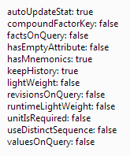

# Workbook.RubProps

Workbook.RubProps
-

# Workbook.RubProps

## Синтаксис

RubProps: Object;

## Описание

Свойство RubProps устанавливает свойства базы данных временных рядов.

## Пример

Для выполнения примера предполагается наличие на странице компонента [WorkbookBox](../../../Components/TimeSeries/WorkbookBox/WorkbookBox.htm) с наименованием «workbookBox» (см. «[Пример создания компонента WorkbookBox](../../../Components/TimeSeries/WorkbookBox/Component_WorkbookBox.htm)»), также необходимо в обработчике события открытия документа добавить следующий код:

	var getRubPropsButt = new PP.Ui.Button({
		ParentNode: document.body, //родительский узел DOM
		Content: "Свойства источника", //подпись
		Click: PP.Delegate(onClickGetRubProps)
	});
	function onClickGetRubProps(){
		var rubKey = wbk.getWbkMetadata().rubrs.def.k;
		var rubProps = wbk.getRubProps(rubKey);
		alert('autoUpdateStat: ' + rubProps['@autoUpdateStat'] +
		'\n' + 'compoundFactorKey: ' + rubProps['@compoundFactorKey'] +
		'\n' + 'factsOnQuery: ' + rubProps['@factsOnQuery'] +
		'\n' + 'hasEmptyAttribute: ' + rubProps['@hasEmptyAttribute'] +
		'\n' + 'hasMnemonics: ' + rubProps['@hasMnemonics'] +
		'\n' + 'keepHistory: ' + rubProps['@keepHistory'] +
		'\n' + 'lightWeight: ' + rubProps['@lightWeight'] +
		'\n' + 'revisionsOnQuery: ' + rubProps['@revisionsOnQuery'] +
		'\n' + 'runtimeLightWeight: ' + rubProps['@runtimeLightWeight'] +
		'\n' + 'unitIsRequired: ' + rubProps['@unitIsRequired'] +
		'\n' + 'useDistinctSequence: ' + rubProps['@useDistinctSequence'] +
		'\n' + 'valuesOnQuery: ' + rubProps['@valuesOnQuery']);
	}

После выполнения примера на html-странице будет размещена кнопка с наименованием «Свойства источника». При нажатии на кнопку будут установлены свойства базы данных временных рядов , и будет выведено следующее сообщение:

См. также:

[Workbook](Workbook.htm)

		Справочная
		 система на версию 10.9
		 от 18/08/2025,
		 © ООО «ФОРСАЙТ»,
