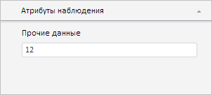

# Workbook.SelectedObsTable

Workbook.SelectedObsTable
-

# Workbook.SelectedObsTable

## Синтаксис

SelectedObsTable: Object

## Описание

Свойство SelectedObsTable определяет объект, содержащий информацию о значениях выделенных в таблице ячеек, а также о значениях их атрибутов наблюдений.

## Комментарии

Значение свойства устанавливается из JSON или с помощью метода setSelectedObsTable, а возвращается - с помощью метода getSelectedObsTable.

Свойство содержит JSON-объект со следующими полями: cells - информация о значениях выделенных в таблице ячейках и их атрибутов наблюдений, @columnCount - количество столбцов, @rowCount - количество строк в таблице.

## Пример

Для выполнения примера необходимо наличие на html-странице компонента [WorkbookBox](../../../Components/TimeSeries/WorkbookBox/WorkbookBox.htm) с наименованием «workbookBox» (см. «[Пример создания компонента WorkbookBox](../../../Components/TimeSeries/WorkbookBox/Component_WorkbookBox.htm)»), а также к источнику данных рабочей книги должен быть добавлен как минимум один атрибут наблюдения (редактирование атрибутов производится только в настольном приложении). Установим новое значение для данного атрибута:

// Получим панель свойств рабочей книги
var propertyBar = workbookBox.getPropertyBarView();
// Получим панель атрибутов наблюдения
var observeAttributesPanel = propertyBar.getObserveAttributesPanel();
// Покажем и раскроем данную панель
observeAttributesPanel.show();
observeAttributesPanel.expand();
// Получим модель данных рабочей книги
var workbook = workbookBox.getSource().getActiveSheet();
// Получим информацию о выделенных ячейках таблицы
var observationsTable = workbook.getSelectedObsTable();
// Укажем для атрибута наблюдения новое значение
var value = {
    c: [{
        "@att": 0,
        "@v": "12"
    }]
};
observationsTable.cells = value;
workbook.setSelectedObsTable(observationsTable);
// Обновим рабочую книгу
workbookBox.refreshAll();

В результате выполнения примера значение первого атрибута на панели «Атрибуты наблюдения» стало равным 12:

См. также:

[Workbook](Workbook.htm)

		Справочная
		 система на версию 10.9
		 от 18/08/2025,
		 © ООО «ФОРСАЙТ»,
