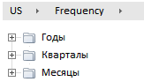
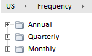

# WorkbookView.cultureChanged

WorkbookView.cultureChanged
-

# WorkbookView.cultureChanged

## Синтаксис

cultureChanged ();

## Описание

Метод cultureChanged обрабатывает события смены культуры.

## Пример

Для выполнения примера предполагается наличие на странице компонента [WorkbookBox](../../../Components/TimeSeries/WorkbookBox/WorkbookBox.htm) с наименованием «workbookBox» (см. «[Пример создания компонента WorkbookBox](../../../Components/TimeSeries/WorkbookBox/Component_WorkbookBox.htm)»), также необходимо в обработчике события открытия документа добавить следующий код:

PP.setCurrentCulture(PP.Cultures.en);
workbookBox.cultureChanged();

После выполнения примера будет изменен язык отображения страницы, в том числе будут переведены названия измерений в цепочке навигации при условии, что в каталоге измерения имеется перевод на английский язык:

До выполнения примера:

После выполнения примера:

См. также:

[WorkbookView](WorkbookView.htm)

		Справочная
		 система на версию 10.9
		 от 18/08/2025,
		 © ООО «ФОРСАЙТ»,
