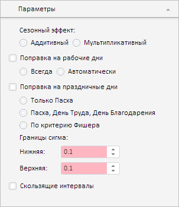
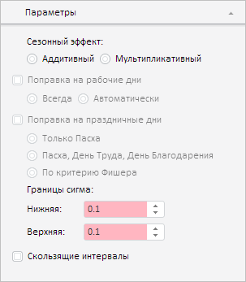

# X11EquationWizardView.setEquationPeriod

X11EquationWizardView.setEquationPeriod
-

# X11EquationWizardView.setEquationPeriod

## Синтаксис

setEquationPeriod(periodMetadata: Object);

## Параметры

*periodMetadata.* Метаданные временного
 ряда, содержащие информацию о периодах расчёта сезонного эффекта. Значение
 периода задаётся с помощью перечисления [PP.TS.Ui.DimCalendarLvl](../../../Enums/DimCalendarLvl.htm).

## Описание

Метод setEquationPeriod управляет
 доступностью элементов управления в мастере выделения сезонности в соответствии
 с периодами расчёта сезонного эффекта.

## Пример

Для выполнения примера необходимо наличие на html-странице компонента
 [WorkbookBox](../../../Components/TimeSeries/WorkbookBox/WorkbookBox.htm)
 с наименованием «workbookBox» (см. «[Пример
 создания компонента WorkbookBox](../../../Components/TimeSeries/WorkbookBox/Component_WorkbookBox.htm)»). Получим и отобразим на панели свойств
 рабочей книги мастер выделения сезонности:

// Получим панель свойств рабочей книги
var propertyBar = workbookBox.getPropertyBarView();
// Получим панель параметров
var parametersPanel = propertyBar.getParametersPanel();
// Отобразим данную панель
parametersPanel.show();
// Развернём панель
parametersPanel.expand();
// Получим мастер для выделения сезонности
var x11EquationWizard = parametersPanel._X11EquationWizard;
// Отобразим данный мастер
x11EquationWizard.show();
В результате выполнения указанного сценария мастер выделения сезонности
 будет выглядеть следующим образом:

Установим для данного мастера период расчёта, равный году:

В результате выполнения примера для мастера выделения сезонности был
 установлен период расчёта сезонности эффекта, равный году, в связи с чем
 некоторые элементы управления в нём стали недоступными:

См. также:

[X11EquationWizardView](X11EquationWizardView.htm)

		Справочная
		 система на версию 10.9
		 от 18/08/2025,
		 © ООО «ФОРСАЙТ»,
