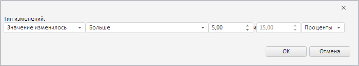

# Пример создания компонента ComponentMismatchWizard

Пример создания компонента ComponentMismatchWizard
-

# Пример создания компонента ComponentMismatchWizard

Для выполнения примера необходимо наличие на html-странице компонента
 [WorkbookBox](../WorkbookBox/WorkbookBox.htm) с наименованием
 «workbookBox» (см. «[Пример
 создания компонента WorkbookBox](../WorkbookBox/Component_WorkbookBox.htm)»). Создадим компонент [ComponentMismatchWizard](ComponentMismatchWizard.htm)
 и отобразим его в [
 окне](dhtmlUi.chm::/Classes/Dialog/Dialog.htm):

// Создадим мастер для выделения изменённых значений данных временных рядов
var componentMismatchWizard = new PP.TS.Ui.ComponentMismatchWizard({
    IsRTL: workbookBox.getIsRTL()
});
// Создадим диалог, в который затем поместим данный мастер
var dialog = new PP.Ui.Dialog({
    Width: 700,
    Height: 130
});
// Поместим мастер в созданный диалог
dialog.setContent(componentMismatchWizard);
// Отобразим диалог c мастером
dialog.show();
// Получим текущие настройки мастера
var state = componentMismatchWizard.getCurrentState();
// Зададим новые настройки для мастера
state.value.percentage = true; // Значение в процентах
state.value.value1 = 5; // Начальное значение
state.value.value2 = 15; // Конечное значение
// Установим мастеру новые настройки
componentMismatchWizard.setCurrentState(state);

В результате выполнения примера был создан и размещён в окне
 [PP.Ui.Dialog](dhtmlUi.chm::/Classes/Dialog/Dialog.htm)
 компонент ComponentMismatchWizard:

См. также:

[ComponentMismatchWizard](ComponentMismatchWizard.htm)

		Справочная
		 система на версию 10.9
		 от 18/08/2025,
		 © ООО «ФОРСАЙТ»,
