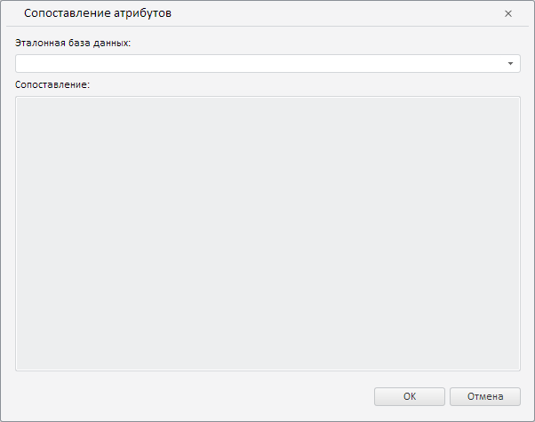
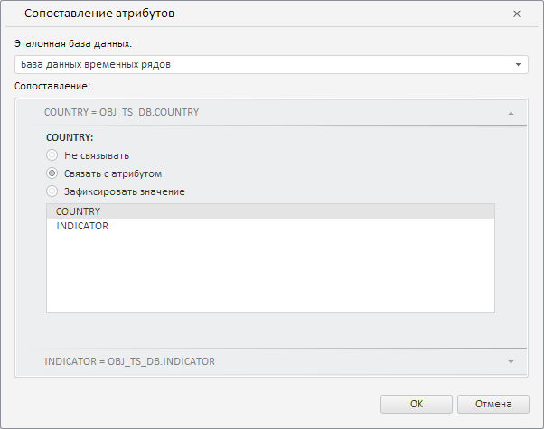

# Пример создания компонента CrossDatabaseMappingsDialog

Пример создания компонента CrossDatabaseMappingsDialog
-

# Пример создания компонента CrossDatabaseMappingsDialog

Для выполнения примера необходимо наличие на html-странице компонента [WorkbookBox](../WorkbookBox/WorkbookBox.htm) с наименованием «workbookBox» (см. «[Пример создания компонента WorkbookBox](../WorkbookBox/Component_WorkbookBox.htm)»). Создадим компонент [CrossDatabaseMappingsDialog](CrossDatabaseMappingsDialog.htm) и отобразим его [в рабочей книге](../WorkbookBox/WorkbookBox.htm):

// Получим модель рабочей книги
var workbook = workbookBox.getSource();
// Создадим диалог сопоставления атрибутов
var crossDatabaseMappingsDialog = new PP.TS.Ui.CrossDatabaseMappingsDialog({
    Source: workbook // Установим источник данных
});
// Отобразим данный диалог
crossDatabaseMappingsDialog.show();

В результате выполнения примера был создан и отображён компонент CrossDatabaseMappingsDialog:

Теперь установим в качестве эталонной базу данных временных рядов, являющуюся текущей для рабочей книги:

// Получим моникёр активной базы данных временных рядов
var odIdArr = workbook.getRub().id.id.split("!");
// Выделим ключ из моникёра
var key = odIdArr[odIdArr.length - 1];
// В качестве эталонной установим базу данных с полученным ключом
var state = {
    comparatorRubKey: key
};
// Зададим для диалога новые настройки
crossDatabaseMappingsDialog.setCurrentState(state);

После выполнения примера в диалоге в качестве эталонной будет установлена текущая база данных временных рядов:

См. также:

[CrossDatabaseMappingsDialog](CrossDatabaseMappingsDialog.htm)

		Справочная
		 система на версию 10.9
		 от 18/08/2025,
		 © ООО «ФОРСАЙТ»,
