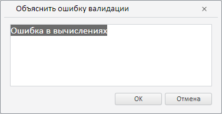

# Пример создания компонента ExplainValidationErrorDialog

Пример создания компонента ExplainValidationErrorDialog
-

# Пример создания компонента ExplainValidationErrorDialog

Для выполнения примера необходимо наличие на html-странице компонента
 [WorkbookBox](../WorkbookBox/WorkbookBox.htm) с наименованием
 «workbookBox» (см. «[Пример
 создания компонента WorkbookBox](../WorkbookBox/Component_WorkbookBox.htm)»). Создадим компонент [ExplainValidationErrorDialog](ExplainValidationErrorDialog.htm)
 и отобразим его [в рабочей книге](../WorkbookBox/WorkbookBox.htm):

// Создадим диалог для объяснения ошибки валидации
var explainValidationErrorDialog = new PP.TS.Ui.ExplainValidationErrorDialog({
    // Укажем ключ ресурсов для отображения заголовка диалога
    ResourceKey: "TSRibbonExplainValidationErrorDialog",
    // Укажем текст, объясняющий текст ошибки
    State: "Ошибка в вычислениях"
});
// Отобразим данный диалог
explainValidationErrorDialog.show();

В результате выполнения примера был создан и отображён компонент ExplainValidationErrorDialog:

См. также:

[ExplainValidationErrorDialog](ExplainValidationErrorDialog.htm)

		Справочная
		 система на версию 10.9
		 от 18/08/2025,
		 © ООО «ФОРСАЙТ»,
