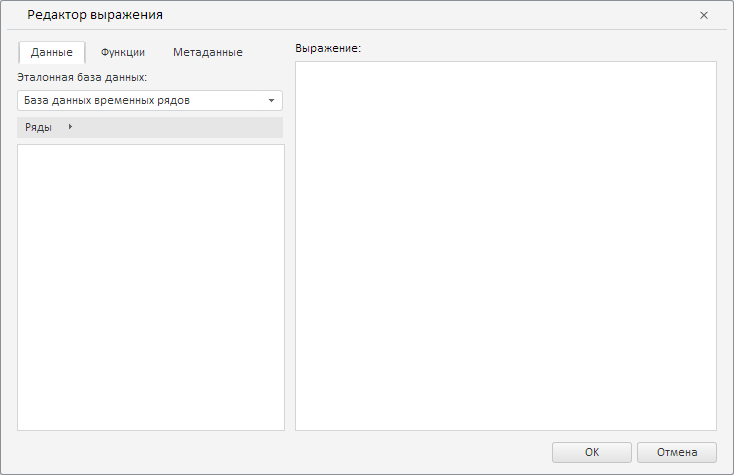
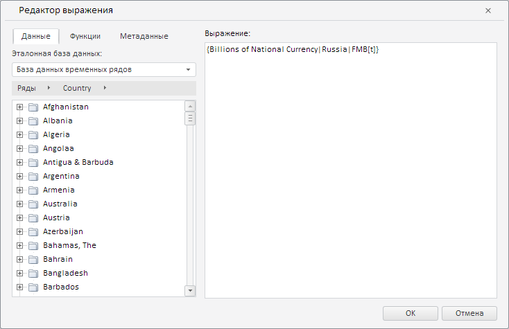

# Пример создания компонента ExpressionEditorDialog

Пример создания компонента ExpressionEditorDialog
-

# Пример создания компонента ExpressionEditorDialog

Для выполнения примера необходимо наличие на html-странице компонента
 [WorkbookBox](../WorkbookBox/WorkbookBox.htm) с наименованием
 «workbookBox» (см. «[Пример
 создания компонента WorkbookBox](../WorkbookBox/Component_WorkbookBox.htm)»). Создадим компонент [ExpressionEditorDialog](ExpressionEditorDialog.htm)
 и отобразим его [в рабочей книге](../WorkbookBox/WorkbookBox.htm):

// Получим модель рабочей книги
var workbook = workbookBox.getSource();
// Получим моникёр активной базы данных временных рядов
var odIdArr = workbook.getRub().id.id.split("!");
// Выделим ключ базы данных временных рядов из моникёра
var key = odIdArr[odIdArr.length - 1];
// Создадим редактор выражения
var expressionEditorDialog = new PP.TS.Ui.ExpressionEditorDialog({
    ResourceKey: "ExpressionEditorDialog", // Определим ключ ресурса для заголовка диалога
    Source: workbook, // Источник данных для диалога
    RubKey: key, // Укажем ключ эталонной базы данных
    RequestMetadata: function (sender, args) {
        console.log("Ключ эталонной базы данных: " + args.getMetadata().RubKey);
    }
});
// Отобразим диалог
expressionEditorDialog.show();

В результате выполнения примера был создан и отображён компонент ExpressionEditorDialog:

При вызове события RequestMetadata
 в консоли браузера был выведен ключ эталонной базы данных:

Ключ эталонной базы данных: 2031

Теперь загрузим в редактор выражения иерархию метабазы и укажем выражение:

// Получим и загрузим в диалог иерархию метабазы
var metaHierarchy = workbook.getHier();
expressionEditorDialog.setHierarchy(metaHierarchy, true);
// Определим выражение для диалога
var expression = "{Billions of National Currency|Russia|FMB[t]}";
// Установим данное выражение
expressionEditorDialog.setCurrentState(expression);
После выполнения примера в редакторе выражения была загружена иерархия
 метабазы и указано выражение «{Billions of National Currency|Russia|FMB[t]}»:

См. также:

[ExpressionEditorDialog](ExpressionEditorDialog.htm)

		Справочная
		 система на версию 10.9
		 от 18/08/2025,
		 © ООО «ФОРСАЙТ»,
