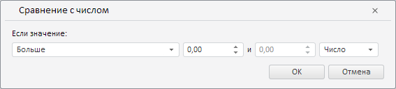

# Пример создания компонента LevelAnalysisDialog

Пример создания компонента LevelAnalysisDialog
-

# Пример создания компонента LevelAnalysisDialog

Для выполнения примера необходимо наличие на html-странице компонента [WorkbookBox](../WorkbookBox/WorkbookBox.htm) с наименованием «workbookBox» (см. «[Пример создания компонента WorkbookBox](../WorkbookBox/Component_WorkbookBox.htm)»). Создадим компонент [LevelAnalysisDialog](LevelAnalysisDialog.htm) и отобразим его [в рабочей книге](../WorkbookBox/WorkbookBox.htm):

// Создадим диалог правила валидации данных путём сравнения их с числом
var levelAnalysisDialog = new PP.TS.Ui.LevelAnalysisDialog({
    // Укажем ключ ресурса для отображения заголовка в диалоге
    ResourceKey: "TSRibbonLevelAnalysisDialog"
});
// Отобразим даннный диалог
levelAnalysisDialog.show();

В результате выполнения примера был создан и отображён компонент LevelAnalysisDialog:

См. также:

[LevelAnalysisDialog](LevelAnalysisDialog.htm)

		Справочная
		 система на версию 10.9
		 от 18/08/2025,
		 © ООО «ФОРСАЙТ»,
