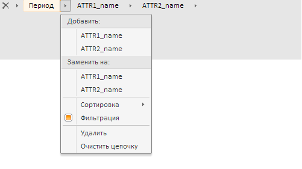

# Пример создания компонента MetaAttributeBreadCrumb

Пример создания компонента MetaAttributeBreadCrumb
-

# Пример создания компонента MetaAttributeBreadCrumb

Для выполнения примера создайте html-страницу и в теге HEAD добавьте
 ссылки на следующие js и css-файлы:

	- PP.js;

	- PP.Metabase.js;

	- PP.Express.js;

	- PP.TS.js;

	- PP.css;

	- PP.Express.css;

	- PP.Metabase.css;

	- PP.TS.css.

Также необходимо наличие рабочей книги с ключом 5183.

В теге SCRIPT добавьте следующий скрипт:

// Устанавливаем локаль для ресурсов
PP.setCurrentCulture(PP.Cultures.ru);
// Объявляем константы
var KEY = 5183; //ключ документа
var IMG_PATH = "build/img/"; //путь к папке с пиктограммами
// Объявляем переменные
var waiter, metabase, tsService, wbk, workbookBox, metabase, waiter;

//Функция для получения функций обработчиков
//В качестве параметра принимает вспомогательную информацию, выводимую в консоль
//при вызове обработчика.
//Это может быть, например, строка, содержащая имя класса и события
function onDummyActionFactory(actionCaption) {
    return function (sender, args) {
        console.log(actionCaption);
        console.log(sender);
        console.log(args);
    }
}

function Ready() //обработчик события загрузки body
{
    // Создаём индикатор загрузки
    waiter = new PP.Ui.Waiter();
    // Создаём соединение с репозиторием
    metabase = new PP.Mb.Metabase({
        Id: "WAREHOUSE",
        UserCreds: {
            UserName: "user",
            Password: "password"
        },
        StartRequest: function () {
            waiter.show();
        },
        EndRequest: function () {
            waiter.hide();
        },
        Error: function (sender, args) {
            alert(args.ResponseText);
        }
    });

    // Открываем соединение с репозиторием
    metabase.open();
    // Создаём сервис для работы с временными рядами
    tsService = new PP.TS.TSService({
        Metabase: metabase
    });
    // Открываем документ
    wbk = tsService.editDocument(KEY, onFirstOpened);
    // Обработчик события открытия документа
    function onFirstOpened(sender, args) {
        //Получаем настройки первоначального отображения для навигационной цепочки
        var xml = wbk.getActiveSheet().getWbkMetadata().attrsTreeOptions.its.it[0].hierAttrs;
        //Получаем иерархию метаданных
        var hierarchy = wbk.getHier();

        //Создаём компонент для отображения и управления атрибутами рабочей книги, основанный
        //на компоненте PP.Ui.Breadcrumb
        var  metaAttributeBreadCrumb = new PP.TS.Ui.MetaAttributeBreadCrumb({
            ParentNode: "example", //родительский узел DOM
            Options: new PP.TS.MetaAttrBrCrOptionParser({
                XML: xml
            }), //Настройки первоначального
            //отображения
            Hierarchy: hierarchy, //источник
            Width: 500, //ширина
            Height: 100, //высота
            ImagePath: IMG_PATH, //путь к папке с пиктограммами
            IsRTL: false // признак отображения текста справа налево
            ItemsCaptionType: PP.TS.BreadcrumbItemCaptionType.SelectedNames // Тип надписи у элемента цепочки навигации
        });
    }
};
В теге <body> в качестве значения атрибута «onLoad» укажите имя
 функции, которая выполняется после окончания загрузки тела страницы:

<body onload="Ready()">
    

</body>
В конце документа вставьте код, устанавливающий стили к вершине «document.body»,
 соответствующие операционной системе клиента:

После выполнения примера на html-странице будет размещен компонент [MetaAttributeBreadCrumb](MetaAttributeBreadCrumb.htm), имеющий
 следующий вид:

Если для показателя в цепочке навигации выбрать несколько элементов,
 то у соответствующей надписи в скобках будут указаны наименования
 первого и последнего выделенного элемента, а также общее количество выбранных
 пунктов. Например, для показателя «Страна» надпись будет следующая:

Страна(American Samoa..Angolaa(2))

См. также:

[DHTML-компоненты](dhtml.chm::/DHTML_components.htm)

		Справочная
		 система на версию 10.9
		 от 18/08/2025,
		 © ООО «ФОРСАЙТ»,
