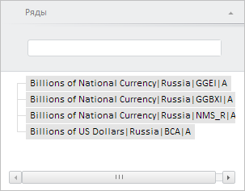

# Пример создания компонента PeriodSeriesViewItem

Пример создания компонента PeriodSeriesViewItem
-

# Пример создания компонента PeriodSeriesViewItem

Для выполнения примера необходимо наличие на html-странице компонента [WorkbookBox](../WorkbookBox/WorkbookBox.htm) с наименованием «workbookBox» (см. «[Пример создания компонента WorkbookBox](../WorkbookBox/Component_WorkbookBox.htm)»). Создадим компонент [PeriodSeriesViewItem](PeriodSeriesViewItem.htm) и отобразим его [в рабочей книге](../WorkbookBox/WorkbookBox.htm):

// Получим панель свойств рабочей книги
var propertyBar = workbookBox.getPropertyBarView();
// Получим мастер для управления временными рядами
var pswPanel = propertyBar.getPeriodSeriesViewPanel();
// Создадим панель «Ряды»
var periodSeriesViewItem = new PP.TS.Ui.PeriodSeriesViewItem({
    Source: workbookBox.getSource(), // Источник данных
    ViewType: PP.Ui.NavigationItem, // Создаём навигационную панель
    Title: "Ряды", //
    OwnerMaster: propertyBar,
    // Обработаем событие загрузки списка рядов
    RootLoaded: function () {
        console.log("Загрузка рядов данных...");
    },
    // Обработаем события изменения позиции размещения данных
    DerivedVisibleChanged: function () {
        console.log("Изменена позиция размещения данных временных рядов");
    }
});
// Добавим созданную панель на панель свойств рабочей книги
propertyBar.addMasterPanel(periodSeriesViewItem);
// Раскроем панель «Ряды»
periodSeriesViewItem.expand();

В результате выполнения примера был создан и отображён компонент PeriodSeriesViewItem:

При создании данного компонента было вызвано событие [RootLoaded](../../../Classes/TimeSeries/PeriodSeriesViewItem/PeriodSeriesViewItem.RootLoaded.htm), обработчик которого вывел в консоли браузера соответствующее уведомление:

Загрузка рядов данных...

См. также:

[PeriodSeriesViewItem](PeriodSeriesViewItem.htm)

		Справочная
		 система на версию 10.9
		 от 18/08/2025,
		 © ООО «ФОРСАЙТ»,
