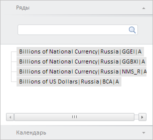

# Пример создания компонента PeriodSeriesViewMaster

Пример создания компонента PeriodSeriesViewMaster
-

# Пример создания компонента PeriodSeriesViewMaster

Для выполнения примера необходимо наличие на html-странице компонента [WorkbookBox](../WorkbookBox/WorkbookBox.htm) с наименованием «workbookBox» (см. «[Пример создания компонента WorkbookBox](../WorkbookBox/Component_WorkbookBox.htm)»). Создадим компонент [PeriodSeriesViewMaster](PeriodSeriesViewMaster.htm) и отобразим его [в рабочей книге](../WorkbookBox/WorkbookBox.htm):

// Получим панель свойств рабочей книги
var propertyBar = workbookBox.getPropertyBarView();
// Создадим мастер для отображения и управления атрибутами рабочей книги
var pswMaster = new PP.TS.Ui.PeriodSeriesViewMaster({
    Source: workbookBox.getSource(), // Источник данных
    DataView: workbookBox.getDataView(),
    RootLoaded: function (sender, args) {
        console.log("Загружены данные для атрибута " + args.MetaAttrId);
    },
    RequestMetadata: function () {
        console.log("Запрос метаданных...");
    }
});
// Добавим данный мастер на панель свойств рабочей книги
propertyBar.addMaster(pswMaster);
// Отобразим данный мастер
pswMaster.show();
// Обновим его
pswMaster.refreshAll();
// Развернём панель «Ряды»
pswMaster.getItems()[0].expand();

В результате выполнения примера был создан и отображён компонент PeriodSeriesViewMaster:

При создании данного компонента было вызвано событие [RootLoaded](../../../Classes/TimeSeries/PeriodSeriesViewMaster/PeriodSeriesViewMaster.RootLoaded.htm), обработчик которого вывел в консоли браузера соответствующее уведомление:

Загружены измерения для атрибута Series

При запросе метаданных в консоли браузера в результате обработки события RequestMetadata также будет выводиться соответствующее сообщение.

См. также:

[PeriodSeriesViewMaster](PeriodSeriesViewMaster.htm)

		Справочная
		 система на версию 10.9
		 от 18/08/2025,
		 © ООО «ФОРСАЙТ»,
