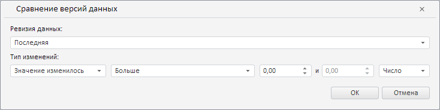

# Пример создания компонента RevisionComparisonDialog

Пример создания компонента RevisionComparisonDialog
-

# Пример создания компонента RevisionComparisonDialog

Для выполнения примера необходимо наличие на html-странице компонента [WorkbookBox](../WorkbookBox/WorkbookBox.htm) с наименованием «workbookBox» (см. «[Пример создания компонента WorkbookBox](../WorkbookBox/Component_WorkbookBox.htm)»). Создадим компонент [RevisionComparisonDialog](RevisionComparisonDialog.htm) и отобразим его в [рабочей книге](../WorkbookBox/WorkbookBox.htm):

// Получим вкладку «Данные» на ленте инструментов рабочей книги
var dataCategory = workbookBox.getRibbonView().getDataCategory();
// Определим возвратную функцию
var onRequestMetadata = function (sender, args) {
    dataCategory.RequestMetadata.fire(dataCategory, args);
};
// Создадим диалог правила валидации данных путём сравнения их версий
var revisionComparisonDialog = new PP.TS.Ui.RevisionComparisonDialog({
    // Укажем ключ ресурса для отображения заголовка в диалоге
    ResourceKey: "TSRibbonVersionDataComparisonDialog",
    // Укажем обработчик события запроса метаданных в компоненте
    RequestMetadata: new PP.Delegate(this.onRequestMetadata, dataCategory),
    Width: 734, // Ширина диалога
    Height: 184 // Высота диалога
});
// Отобразим данный диалог
revisionComparisonDialog.show();

В результате выполнения примера был создан и отображён компонент RevisionComparisonDialog:

См. также:

[RevisionComparisonDialog](RevisionComparisonDialog.htm)

		Справочная
		 система на версию 10.9
		 от 18/08/2025,
		 © ООО «ФОРСАЙТ»,
