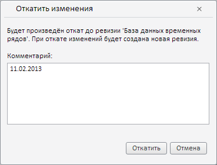

# Пример создания компонента RollbackRevisionDlg

Пример создания компонента RollbackRevisionDlg
-

# Пример создания компонента RollbackRevisionDlg

Для выполнения примера необходимо наличие на html-странице компонента [WorkbookBox](../WorkbookBox/WorkbookBox.htm) с наименованием «workbookBox» (см. «[Пример создания компонента WorkbookBox](../WorkbookBox/Component_WorkbookBox.htm)»). Создадим компонент [RollbackRevisionDlg](RollbackRevisionDlg.htm) и обработаем событие нажатия на кнопку «Откатить», выводя в консоли браузера текст комментария данного диалога:

// Получим панель свойств рабочей книги
var propertyBar = workbookBox.getPropertyBarView();
// Получим источник данных рабочей книги
var source = propertyBar.getSource();
// Получим метаданные рабочей книги
var metadata = source.getWbkMetadata();
// Получим первую базу данных временных рядов
var rubr = metadata.rubrs.its.it[0];
// Определим ключ базы данных временных рядов
var rubKey = rubr.k;
// Создадим диалог отката ревизии
var rollbackRevisionDialog = new PP.TS.Ui.RollbackRevisionDlg({
    OkButtonClicked: function () {
        console.log("Комментарий: " + rollbackRevisionDialog.getComment());
    },
    RubName: rubr.n // База данных временных рядов
});
// Отобразим созданный диалог
rollbackRevisionDialog.show();

В результате выполнения примера был создан компонент RollbackRevisionDlg:

После нажатия на кнопку «Откатить» в консоли браузера был выведен текст комментария созданного диалога:

Комментарий: 11.02.2013

См. также:

[RollbackRevisionDlg](RollbackRevisionDlg.htm)

		Справочная
		 система на версию 10.9
		 от 18/08/2025,
		 © ООО «ФОРСАЙТ»,
