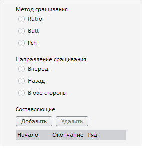

# Пример создания компонента SpliceMethodWizard

Пример создания компонента SpliceMethodWizard
-

# Пример создания компонента SpliceMethodWizard

Для выполнения примера необходимо наличие на html-странице компонента
 [WorkbookBox](../WorkbookBox/WorkbookBox.htm) с наименованием
 «workbookBox» (см. «[Пример
 создания компонента WorkbookBox](../WorkbookBox/Component_WorkbookBox.htm)»). Создадим компонент [SpliceMethodWizard](SpliceMethodWizard.htm)
 и разместим его на [вкладке
 «Параметры»](../../../Classes/TimeSeries/ParametersPanel/ParametersPanel.htm) [боковой
 панели](../WbkPropertyBar/WbkPropertyBar.htm) рабочей книги:

// Получим панель свойств рабочей книги
var propertyBar = workbookBox.getPropertyBarView();
// Получим панель параметров
var parametersPanel = propertyBar.getParametersPanel();
// Отобразим данную панель
parametersPanel.show();
// Развернём панель
parametersPanel.expand();
// Получим DOM-поддерево для данной панели
var container = parametersPanel.getContentDomNode();
// Создадим мастер настройки сращивания временных рядов
var spliceMethodWizard = new PP.TS.Ui.SpliceMethodWizard({
    Source: propertyBar.getSource(),
    IsRTL: parametersPanel.getIsRTL()
});
// Добавим мастер в DOM-поддерево
spliceMethodWizard.addToNode(container);

В результате выполнения примера на вкладке «Параметры» боковой панели
 рабочей книги был размещён созданный компонент SpliceMethodWizard:

См. также:

[SpliceMethodWizard](SpliceMethodWizard.htm)

		Справочная
		 система на версию 10.9
		 от 18/08/2025,
		 © ООО «ФОРСАЙТ»,
