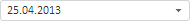
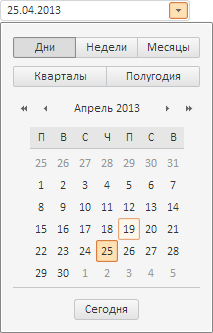

# Пример создания компонента TsSpliceDateEditor

Пример создания компонента TsSpliceDateEditor
-

# Пример создания компонента TsSpliceDateEditor

Для выполнения примера необходимо создать html-страницу и выполнить
 следующие действия:

1. Добавить ссылки на следующие css-файлы: PP.css, PP.Express.css, PP.Metabase.css.

Также нужно добавить ссылки на js-файлы: jquery.js, PP.js, PP.Metabase.js,PP.Express.js,
 PP.TS.js и resources.ru.js.

2. Далее в теге <head> необходимо добавить скрипт, создающий компонент
 [TsSpliceDateEditor](TsSpliceDateEditor.htm):

3. В теге <body> размещаем блок с идентификатором «parentDiv»,
 в котором будет отображаться созданный компонент:

<body>
    

</body>

В результате выполнения примера был создан и отображён компонент TsSpliceDateEditor:

4. Для того чтобы раскрыть данный компонент, выполните в консоли браузера
 следующий сценарий:

// Получим вложенный редактор даты и времени
var dateTimePicker = spliceDateEditor._SpliceDatePicker;
// Раскроем данный редактор
dateTimePicker.showDropPanel();
После запуска данного сценария редактор даты будет раскрыт:

См. также:

[TsSpliceDateEditor](TsSpliceDateEditor.htm)

		Справочная
		 система на версию 10.9
		 от 18/08/2025,
		 © ООО «ФОРСАЙТ»,
