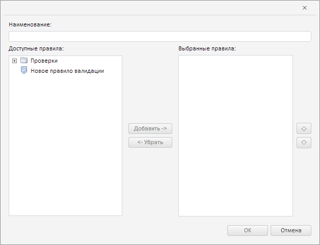
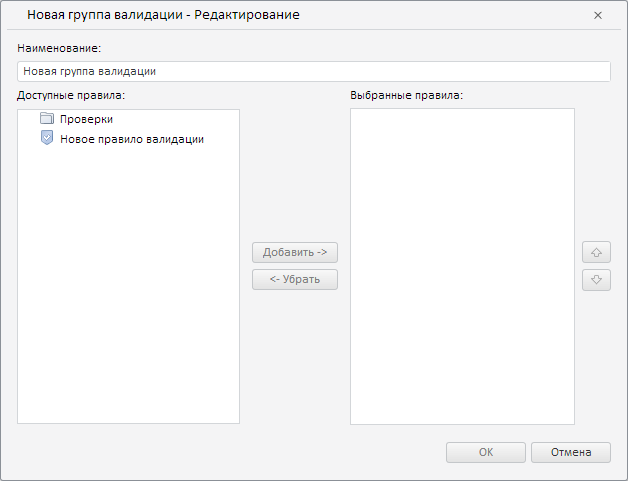

# Пример создания компонента ValidationGroupSettingsDialog

Пример создания компонента ValidationGroupSettingsDialog
-

# Пример создания компонента ValidationGroupSettingsDialog

Для выполнения примера необходимо наличие на html-странице компонента
 [WorkbookBox](../WorkbookBox/WorkbookBox.htm) с наименованием
 «workbookBox» (см. «[Пример
 создания компонента WorkbookBox](../WorkbookBox/Component_WorkbookBox.htm)»). Создадим компонент [ValidationGroupSettingsDialog](ValidationGroupSettingsDialog.htm)
 и отобразим его [в рабочей книге](../WorkbookBox/WorkbookBox.htm):

// Получим модель рабочей книги
var workbook = workbookBox.getSource();
// Создадим диалог для создания группы правил
var validationGroupSettingsDialog = new PP.TS.Ui.ValidationGroupSettingsDialog({
    Source: workbook // Установим источник данных
});
// Отобразим данный диалог
validationGroupSettingsDialog.show();

В результате выполнения примера был создан и отображён компонент ValidationGroupSettingsDialog:

Теперь установим для созданного диалога заголовок и наименование группы
 правил валидации:

// Определим настройки для данного диалога
var name = "Новая группа валидации";
var state = {
    obInst: {
        obDesc: {
            i: "OBJ3229", // Идентификатор группы
            k: 3229, // Ключ группы
            n: name // Её наименование
        }
    }
};
// Применим настройки
validationGroupSettingsDialog.setCurrentState(state);
// Установим заголовок диалога
validationGroupSettingsDialog.setCaption(name + " - Редактирование");
После выполнения примера для диалога будет установлен заголовок «Новая
 группа валидации - Редактирование» и наименование группы правил «Новая
 группа валидации»:

См. также:

[ValidationGroupSettingsDialog](ValidationGroupSettingsDialog.htm)

		Справочная
		 система на версию 10.9
		 от 18/08/2025,
		 © ООО «ФОРСАЙТ»,
