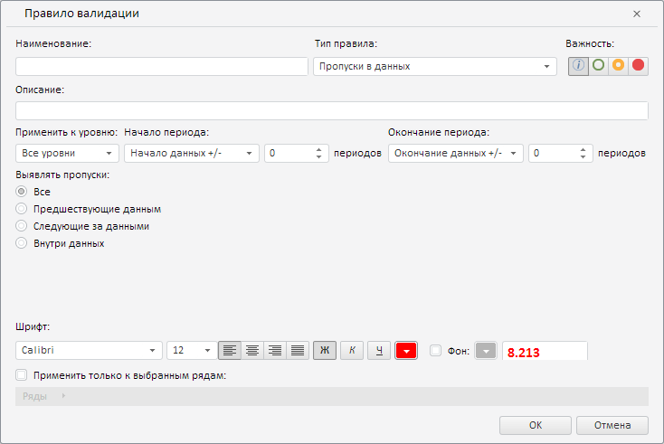

# Пример создания компонента ValidationSettingsDialog

Пример создания компонента ValidationSettingsDialog
-

# Пример создания компонента ValidationSettingsDialog

Для выполнения примера необходимо наличие на html-странице компонента
 [WorkbookBox](../WorkbookBox/WorkbookBox.htm) с наименованием
 «workbookBox» (см. «[Пример
 создания компонента WorkbookBox](../WorkbookBox/Component_WorkbookBox.htm)»). Создадим компонент [ValidationSettingsDialog](ValidationSettingsDialog.htm)
 и отобразим его [в рабочей книге](../WorkbookBox/WorkbookBox.htm):

// Получим модель рабочей книги
var workbook = workbookBox.getSource();
// Получим вкладку «Данные» на ленте инструментов рабочей книги
var dataCategory = workbookBox.getRibbonView().getDataCategory();
// Определим возвратную функцию
var onRequestMetadata = function (sender, args) {
    console.log("Запрос метаданных...");
    dataCategory.RequestMetadata.fire(dataCategory, args);
};
// Создадим диалог для создания группы правил
var validationSettingsDialog = new PP.TS.Ui.ValidationSettingsDialog({
        /* Установим ключ ресурса для отображения заголовка диалога */
        ResourceKey: "TSRibbonValidationSettingsDialog",
        Source: workbook, // Установим источник данных
        RequestMetadata: new PP.Delegate(this.onRequestMetadata, dataCategory)
    });
// Отобразим данный диалог
validationSettingsDialog.show();

В результате выполнения примера был создан и отображён компонент ValidationSettingsDialog:

При создании данного компонента было сгенерировано событие RequestMetadata,
 при обработке которого в консоли браузера было выведено соответствующее
 уведомление:

Запрос метаданных...

См. также:

[ValidationSettingsDialog](ValidationSettingsDialog.htm)

		Справочная
		 система на версию 10.9
		 от 18/08/2025,
		 © ООО «ФОРСАЙТ»,
