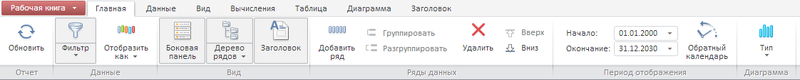

# Пример создания компонента WbkRibbon

Пример создания компонента WbkRibbon
-

# Пример создания компонента WbkRibbon

Для выполнения примера необходимо создать html-страницу и выполнить следующие действия:

1. Добавить ссылки на следующие css-файлы:

-
 PP.css,

-
 PP.Express.css,

-
 PP.TS.css,

-
 PP.Metabase.css.

Также нужно добавить ссылки на js-файлы:

-
 jquery.js,

-
 PP.js,

-
PP.Metabase.js

-
PP.Express.js,

-
PP.MapChart.js,

-
PP.TS.js,

-
resources.ru.js,

-
Startup.resources.ru.js.

2. В теге <body> в качестве значения атрибута «onLoad» указываем имя функции, которая выполняется после окончания загрузки тела страницы:

<body onload="Ready()">
	

</body>

3. В конце документа вставляем код для установки стилей к вершине «document.body», которые соответствуют операционной системе клиента:

4. Далее в теге <head> необходимо добавить скрипт, создающий контейнер для ленты инструментов экспресс-отчета WbkRibbon:

var metabase = null;
		var waiter, tsService, source;
		var ribbon, ribbonView;
		function Ready()
		{
			waiter = new PP.Ui.Waiter();
			metabase = new PP.Mb.Metabase(
			{
				ExportUrl: "PPService.axd?action=export",
				ImportUrl: "PPService.axd?action=import",
				PPServiceUrl: "PPService.axd?action=proxy",
				Id: "p7mart_ms",
				UserCreds: { UserName: "sa", Password: "H88cp229" },
				StartRequest: function ()
				{
					waiter.show();
				},
				EndRequest: function ()
				{
					waiter.hide();
				},
				Error: function (sender, args)
				{
					alert(args.ResponseText);
				}
			});
			metabase.open();
			tsService = new PP.TS.TSService({ Metabase: metabase });
			source = tsService.editDocument(WORKBOOKKEY);
			ribbon = new PP.TS.Ui.WbkRibbon({
				Source: source,
				ParentNode: "example",
				ImagePath: "../build/img/"
			});
			ribbon.setEnabled(true);
		}

После выполнения примера на html-странице будет размещен компонент WbkRibbon:

См. также:

[WbkRibbon](../../../Classes/TimeSeries/WbkRibbon/WbkRibbon.htm)

		Справочная
		 система на версию 10.9
		 от 18/08/2025,
		 © ООО «ФОРСАЙТ»,
