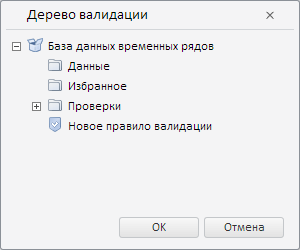

# Пример создания компонента WbkValidationTree

Пример создания компонента WbkValidationTree
-

# Пример создания компонента WbkValidationTree

Для выполнения примера необходимо наличие на html-странице компонента
 [WorkbookBox](../WorkbookBox/WorkbookBox.htm) с наименованием
 «workbookBox» (см. «[Пример
 создания компонента WorkbookBox](../WorkbookBox/Component_WorkbookBox.htm)»). Создадим компонент [WbkValidationTree](WbkValidationTree.htm)
 и отобразим его в [диалоге](dhtmlUi.chm::/classes/Dialog/Dialog.htm):

// Получаем модель рабочей книги
var source = workbookBox.getSource();
// Создаём дерево валидации
validationTree = new PP.TS.Ui.WbkValidationTree({
    Source: source, // Источник данных
    // Обрабатываем событие запроса метаданных
    RequestMetadata: function () {
        console.log("Запрос метаданных...");
    },
    // Сервис рабочей книги
    Service: source ? source.getPPService() : null,
    Class: "Item ValidationTreeList", // Список CSS-классов
    ShowRootFolder: true, // Разрешим отображать корневую папку
    // Отображаем только правила валидации и группы правил
    Filter: [PP.Mb.MetabaseObjectClass.KE_CLASS_VALIDATIONFILTER, PP.Mb.MetabaseObjectClass.KE_CLASS_VALIDATIONGROUP],
    Metabase: source ? source.getMetabase() : null, // Репозиторий
    // Ключ корневой папки дерева
    RootKey: source && source.hasRubrs() ? source.getWbkMetadata().rubrs.def.k : 0,
    Width: 230,
    Height: 180,
});
// Добавляем созданное дерево в диалог
var dialog = new PP.Ui.Dialog({
    Caption: "Дерево валидации", // Заголовок диалога
    Content: validationTree,
    Width: 300, // Ширина диалога
    Height: 250 // Высота диалога
});
// Отображаем данный диалог
dialog.show();

В результате выполнения примера был создан и отображён в диалоге компонент
 WbkValidationTree:

В результате обработки события RequestMetadata
 каждый раз при запросе метаданных в консоли браузера будет выводиться
 соответствующее уведомление.

См. также:

[WbkValidationTree](WbkValidationTree.htm)

		Справочная
		 система на версию 10.9
		 от 18/08/2025,
		 © ООО «ФОРСАЙТ»,
