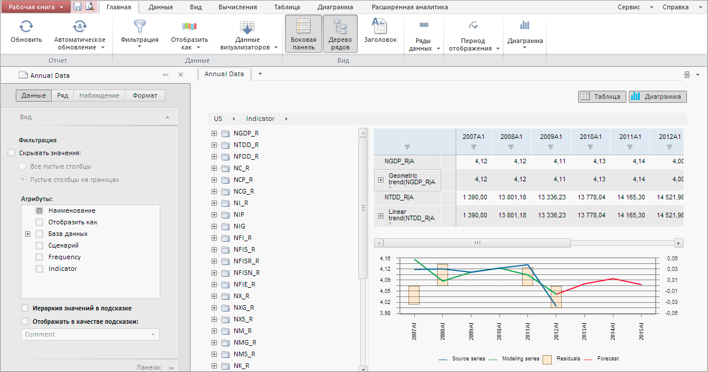

# Пример создания компонента WorkbookBox

Пример создания компонента WorkbookBox
-

# Пример создания компонента WorkbookBox

Для выполнения примера необходимо наличие рабочей книги с ключом 66642.
 Создайте html-страницу и выполните следующие действия:

1. В теге <head> добавьте ссылки на js и css-файлы:

	- PP.js;

	- PP.Metabase.js;

	- PP.Express.js;

	- PP.TS.js.

	- PP.css;

	- PP.Express.css;

	- PP.TS.css;

2. Добавьте скрипт для отображения рабочей книги:

3. В теге <body> в качестве значения атрибута «onLoad» укажите
 имя функции для загрузки рабочей книги:

<body onselectstart="return false" class="PPNoSelect" onload="Ready()" style="margin: 0px">
    

    

</body>

В результате выполнения примера на html-странице будет размещена рабочая
 книга, имеющая следующий вид:

См. также:

[DHTML-компоненты](dhtml.chm::/DHTML_components.htm)

		Справочная
		 система на версию 10.9
		 от 18/08/2025,
		 © ООО «ФОРСАЙТ»,
