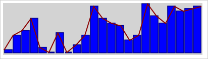

# Sparkline.draw

Sparkline.draw
-

# Sparkline.draw

## Синтаксис

draw(isRedrawCanvas: Boolean);

## Параметры

isRedrawCanvas. Признак перерисовывания области спарклайна. Если значение
 параметра равно true, то область
 спарклайна будет перерисована, иначе - нет.

## Описание

Метод draw отрисовывает спарклайн.

## Пример

Для выполнения примера предполагается наличие на странице спарклайн
 c наименованием «sparkline» (см. «[Пример
 создания компонента Sparkline](../../Components/Sparkline/Example_Sparkline.htm)»). Пример нужно разместить в теге <script>.
 Добавим новые данные в спарклайн и перерисуем его:

// Добавляем данные
sparkline.beginUpdate();
sparkline.getValues().push(18, 19, 20);
sparkline.endUpdate();
// Перерисовываем спарклайн
sparkline.draw(true);
В результате в спарклайн будут добавлены новые данные:

См. также:

[Sparkline](Sparkline.htm)

		Справочная
		 система на версию 10.9
		 от 18/08/2025,
		 © ООО «ФОРСАЙТ»,
