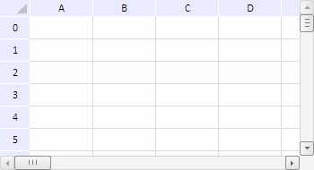

# Конструктор DefaultTabSheetDataSource

Конструктор DefaultTabSheetDataSource
-

**

# Конструктор DefaultTabSheetDataSource

## Синтаксис

PP.Ui.DefaultTabSheetDataSource();

## Описание

Конструктор DefaultTabSheetDataSource создает экземпляр класса DefaultTabSheetDataSource.**

## Пример

Для выполнения примера необходимо наличие на html-странице компонента [TabSheet](../../../Components/TabSheet/TabSheet/TabSheet.htm) с наименованием «tabSheet» (см. «[Пример создания компонента TabSheet](../../../Components/TabSheet/TabSheet/TabSheet_Example.htm)»). Создадим и установим для таблицы источник данных по умолчанию. Определим, является ли он асинхронным, загрузим в таблицу значения и диапазоны ячеек и обработаем соответствующие события - MeasuresLoaded и RangeLoaded:

// Создадим источник данных по умолчанию
var dataSource = new PP.Ui.DefaultTabSheetDataSource();
// Определим, является источник данных синхронным или асинхронным
console.log("Источник данных " + (dataSource.getIsAsync() ? "асинхронный." : "синхронный."));
// Обработаем событие загрузки значений
dataSource.MeasuresLoaded.add(function (sender, eventArgs) {
    var cells = eventArgs.Data.Cells;
    console.log("Количество ячеек с загруженными значениями: " + cells.Cell.length);
});
// Обработаем событие загрузки диапазонов
dataSource.RangeLoaded.add(function (sender, eventArgs) {
    var ranges = eventArgs.Ranges;
    for (var i in ranges) {
        var corners = ranges[i].getCorners();
        var tlc = corners.tlCoord;
        var brc = corners.brCoord;
        console.log("Загружен диапазон (" + tlc.rowIndex + ", " + tlc.colIndex + ")-(" + brc.rowIndex + ", " + brc.colIndex + ")");
    }
});
// Установим источник данных для таблицы
tabSheet.setDataSource(dataSource);

После выполнения примера для таблицы был задан источник данных по умолчанию, в результате чего она приняла следующий вид:

В консоли браузера было показано сообщение о том, что источник данных по умолчанию синхронный, а также выведены количество ячеек с загруженными значениями и список загруженных диапазонов:

Источник данных синхронный.

Количество ячеек с загруженными значениями: 0

Загружен диапазон (0, 0)-(6, 4)

См. также:

[TabSheetAdjustmentMgr](../TabSheetAdjustmentMgr/TabSheetAdjustmentMgr.htm)

		Справочная
		 система на версию 10.9
		 от 18/08/2025,
		 © ООО «ФОРСАЙТ»,
